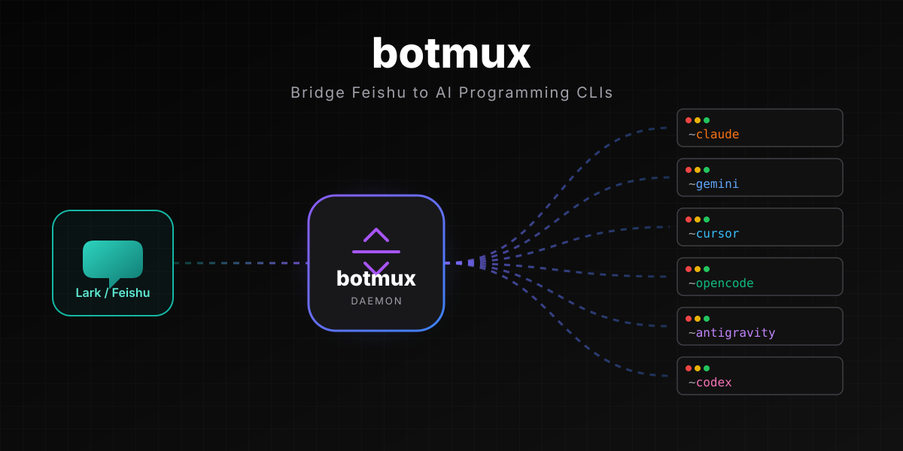

# botmux

<p align="center">
  
</p>

<p align="center">
  <a href="https://www.npmjs.com/package/botmux"></a>
  
  <a href="LICENSE"></a>
  <a href="https://github.com/deepcoldy/botmux"></a>
</p>

<p align="center"><b>在飞书里遥控你的 AI 编程 CLI。</b>一条消息启动一个会话，每个会话一个独立 CLI 进程，实时流式回传——手机、电脑、终端三端同步。</p>

<p align="center">
  <a href="https://deepcoldy.github.io/botmux/"><b>📖 文档</b></a> ·
  <a href="#5-分钟接入"><b>🚀 快速接入</b></a> ·
  <a href="https://bytedance.larkoffice.com/wiki/UBOXwH01CixfxfkqxUpcKgvQnsg"><b>✨ 效果展示</b></a> ·
  <a href="README.en.md">English</a>
</p>

<p align="center">
  
</p>

---

Daemon 监听飞书消息，为每个新会话自动 spawn 一个独立的会话进程，把 AI 编程 CLI / Agent 的输出实时流式回传成飞书卡片，并提供可交互的 Web 终端。它**不重造 Agent 能力**，而是直接桥接你已经在用的工具（**20+ CLI / Agent 适配器**，见 [支持的 CLI / Agent](#支持的-cli--agent)）。

## 它解决什么

- **Agent 收不到通知、手机控不了** — CLI 跑在开发机上，人在手机上。botmux 把每轮输出推成飞书卡片，随时随地查看 / 追问 / 打断，还能开可写 Web 终端直接操作。
- **CLI 不感知飞书上下文** — 把机器人拉进话题群 / oncall 群，@ 一句就在你本机的代码库里开跑；会话可以用 `/relay` 原样搬到另一个群，上下文一点不丢。
- **单个 Agent 不够用** — 同一个群里放多个不同 CLI 的机器人，@ 谁谁干活，让 Claude Code 和 Codex 一起 review 同一个 MR、各自独立分析、观点不同自动互怼。

## 5 分钟接入

> 约 5 分钟：`botmux setup` 一次飞书扫码就连续建好应用、配全权限、发版（加 `--no-open-platform-auto` 则只建应用、跳过权限与发版的自动配置，之后需手动完成；手动创建 / 粘贴凭证是 setup 里的另一个选项）。

```bash
curl -fsSL https://raw.githubusercontent.com/deepcoldy/botmux/master/install.sh | sh
botmux setup                 # 一次扫码建应用 → 选 CLI → 选工作目录（自动配权限 + 发版）
botmux start                 # 启动 daemon（botmux autostart enable 设开机自启）
```

> botmux 本体是一个**自包含单文件二进制**，运行时已嵌在里面——**装它和跑它都不需要机器上有 Node**（你要接的 AI 编程 CLI 自己需要什么另算）。装到 `~/.botmux/bin/botmux`（`BOTMUX_INSTALL_DIR` 可改），按 OS/arch 自动选对应二进制、校验 SHA-256，并把 `~/.botmux/bin` 写进你当前 shell 的启动文件（zsh / bash / fish 各写对的那个），**开个新终端就能用**。
>
> 安装过程**不编译任何原生模块**（不需要 Python / node-gyp / 编译器）：PTY 已经嵌在二进制里。支持 linux / macOS × x64 / arm64（Alpine 等 musl 环境自动选 musl 版）；**Windows 请在 WSL2 里安装**（daemon 依赖 PTY / tmux / Unix 信号，原生 Windows 跑不了；WSL2 报告为 linux，是完整支持的一等环境）。平台不在列表里、或下下来的二进制在本机跑不起来，安装会**明确报错并保留原有版本**，而不是装上一个起不来的命令。
>
> 升级：`botmux upgrade`（原地换二进制），或**重跑一遍上面那条 curl 命令**——同样原地升级，不会重复往启动文件里追加 PATH。

<details>
<summary>已经在用 Node 生态？也可以走 npm（同一个二进制）</summary>

```bash
npm install -g botmux        # 需要 Node >= 22 装包本身
```

npm 包内带的是**同一个自包含二进制**（按 os/arch 只装匹配的那一个），postinstall 把 `~/.botmux/bin/botmux` 指向它并同样写 PATH。所以装完只有**一个** botmux 版本，不再出现「装了两个 Node 版本、各自带一份全局 botmux 互相打架 / 不知道更新了哪个」。

区别只在**谁来装、以后谁来升**：npm 路径需要 Node ≥ 22 才能执行安装本身，升级交回 `npm i -g botmux@latest`；curl 路径全程不碰 Node。跑起来之后两者完全一致——同样的二进制、同样的命令。

</details>

然后私聊机器人、或 `botmux dashboard` 拉个群，直接开聊。完整步骤（含 Lark 国际版、`--no-open-platform-auto` 后手动配置权限 / 发版、排查）见 **[5 分钟快速接入](https://deepcoldy.github.io/botmux/quickstart)**。

## 核心场景

- **[实时流式卡片](https://deepcoldy.github.io/botmux/cards)** — 每轮对话一张实时刷新的卡片，终端画面原样截图回传；一键显示/隐藏输出、翻屏、重启/关闭/接管会话。
- **[多机器人协作](https://deepcoldy.github.io/botmux/multi-bot)** — 同群多 bot @mention 路由，不同 CLI 背后不同模型，天然多样性；方案评审 / 代码 review / 技术选型让它们互相挑刺。
- **[多话题并行编排](https://deepcoldy.github.io/botmux/multi-topic)** — 给编排者一个大任务，它自动在群里种话题、拉各 bot 起独立会话跑流水线，飞书任务面板一眼看完所有子任务进度。
- **[可交互 Web 终端](https://deepcoldy.github.io/botmux/web-terminal)** — 不只是看输出，浏览器 / 手机直接操作 CLI，移动端带悬浮快捷键栏（Esc、Ctrl+C、方向键）。
- **[会话接入 & 接力](https://deepcoldy.github.io/botmux/adopt)** — 本地 tmux 里跑到一半，手机 `/adopt` 接管；`/relay` 把整个会话（原进程、原记忆）搬进团队群继续。
- **[定时任务](https://deepcoldy.github.io/botmux/schedule) & [外部触发](https://deepcoldy.github.io/botmux/webhook)** — 自然语言配周期任务（报警分析 / 群总结）；从外部系统编程式触发用 [Webhook](https://deepcoldy.github.io/botmux/webhook) 或 [API 任务触发](https://deepcoldy.github.io/botmux/api-task-trigger)。
- **[Oncall 模式](https://deepcoldy.github.io/botmux/oncall) & [语音总结](https://deepcoldy.github.io/botmux/voice)** — 拉进 oncall 群，任何成员 @ 即在项目目录排查；配好 TTS 后每张卡片页脚会多一个 🔊 语音总结按钮，让模型「说人话」。

更多：[角色与团队](https://deepcoldy.github.io/botmux/roles) · [文件沙盒](https://deepcoldy.github.io/botmux/sandbox) · [Dashboard 管控面](https://deepcoldy.github.io/botmux/dashboard) · [tmux 会话常驻](https://deepcoldy.github.io/botmux/tmux) · [飞书会议智能体（效果展示）](https://bytedance.larkoffice.com/wiki/UBOXwH01CixfxfkqxUpcKgvQnsg)。

## 支持的 CLI / Agent

`bots.json` 里用 `cliId` 一键切换。**20+ 适配器**，覆盖本地 CLI（进程隔离，`tmux attach` 可直连）和 API / 云 Agent（如 Mira、riff——通过 API / 远端接入，非本地进程；mojo 为 API 驱动、默认在宿主机执行工具，可配 cloud: true 走云沙箱）。代表项：

`claude-code` · `codex` · `gemini` · `cursor` · `opencode` · `opencode2` · `antigravity` · `copilot` · `grok` · `kimi` · `kiro-cli` · `reasonix` · `dsh` · `aiden` · `coco`(TRAE) · `hermes` · `ebsd` · `mira` · `learningflow`(LearningFlow Agent) · `riff`(云 Agent) … · `mojo`(API 驱动,默认宿主机执行) …

`ebsd` 使用独立的外部服务身份和原生 OMP 会话目录；部署方必须通过受限权限文件配置 Diag Gateway token 与 ByteCloud service account，不能把密钥写入 `bots.json`。

`bots.json` 里只放非敏感元数据和密钥文件路径，例如：

```json
{
  "cliId": "ebsd",
  "workingDir": "/var/lib/botmux/ebsd-work",
  "sandbox": true,
  "env": {
    "EBSD_BOTMUX_DIAG_ENDPOINT": "https://ebsbot.example",
    "EBSD_BOTMUX_DIAG_TOKEN_FILE": "/run/secrets/ebsd-botmux/diag-token",
    "EBSD_BOTMUX_BYTECLOUD_ACCESS_KEY_FILE": "/run/secrets/ebsd-botmux/bytecloud-ak",
    "EBSD_BOTMUX_BYTECLOUD_SECRET_KEY_FILE": "/run/secrets/ebsd-botmux/bytecloud-sk",
    "EBSD_BOTMUX_SUBJECT": "botmux-ebsd@prod",
    "EBSD_BOTMUX_REPOSITORY_ROOT": "/srv/repos"
  }
}
```

三个密钥文件必须是运行 BotMux 的账号持有的 `0600` 普通文件，不能是符号链接；文件内容、AK/SK 和 Gateway token 都不得写进 `bots.json`。`workingDir` 应是专用空目录，仓库通过只读的 `EBSD_BOTMUX_REPOSITORY_ROOT` 暴露。Linux 开启 `sandbox` 前需安装 bubblewrap，隔离建立失败时会拒绝启动。当前/上一把 Gateway key 可以在服务端并存完成轮换，subject 保持不变。

当前完整 `cliId` 以 [`src/adapters/cli/registry.ts`](https://github.com/deepcoldy/botmux/blob/master/src/adapters/cli/registry.ts) 为准；各 CLI 的配置与套 wrapper / 网关方法见 [多 CLI 适配器](https://deepcoldy.github.io/botmux/adapters)。

### 会话级 CLI 选择

在会话尚未启动前，可以用 `/cli <cliId>` 为当前会话选择已注册的 CLI，例如：

```text
/cli codex
```

这个选择只切换裸 CLI 适配器，不继承当前 bot 配置中的 `wrapperCli`、`model` 或 `startupCommands`。因此依赖 `ttadk`、`aiden` 等 wrapper / 网关才能启动的 CLI，不适合用会话级选择切换；应直接把 bot 默认配置设为对应的 wrapper 组合。会话启动后 CLI 选择冻结，后续消息和恢复都会继续使用该 CLI。

### 最终回答反馈（按 bot、默认关闭）

在单个 `bots.json` 条目中设置 `feedback.enabled: true`，可在最终回答卡片中收集固定三态语义 `positive / progress / negative` 的反馈；默认按钮为“结论可用 / 有效推进 / 结论有误”。按钮文案、样式、顺序、可见语义、负向原因、说明框与是否允许改选均可配置。默认关闭，`apiOnly` bot、进度卡、自定义卡、通知和语音不显示反馈控件。当前仅本次提问者可反馈，提交后原卡片原地更新，自由文本不会回显到群卡。

```json
{
  "feedback": {
    "enabled": true,
    "visibleSemantics": ["positive", "progress", "negative"],
    "buttons": [
      { "key": "conclusive_usable", "label": "结论可用", "semantic": "positive", "style": "primary" },
      { "key": "effective_progress", "label": "有效推进", "semantic": "progress", "style": "default" },
      { "key": "incorrect", "label": "结论有误", "semantic": "negative", "style": "danger" }
    ],
    "negativeFollowup": {
      "reasons": [{ "key": "wrong_result", "label": "结论或结果错误" }],
      "comment": { "enabled": true, "required": false, "maxLength": 1000 }
    }
  }
}
```

也可在 Dashboard 的「Bot 配置 → 卡片 → 最终回答反馈」编辑，或用 `/botconfig set feedback '<json>'` 热更新。策略支持本地团队 → bot → bot-scoped chat 分层，优先级为 chat > bot > team；Dashboard 可预览最终生效策略。策略修改只影响之后交付的新卡；已发送卡片继续使用发送时快照。Agent 主动发送可声明 `botmux send --response-kind progress ...` 或 `botmux send --response-kind final ...`；未声明时默认按 progress/非 final 发送，只有显式 final 才挂反馈。数据仅落在本机 `botmux-feedback.sqlite`；可选 webhook 通过 durable outbox 投递 `turn.completed` 与 `feedback.revised` 事件。完整实现和边界见 [`docs/feedback-capability-current-implementation.md`](docs/feedback-capability-current-implementation.md)。

严格兼容 Codex 参数、交互与会话存储的独立发行版无需新增适配器：保留 `cliId: "codex"`，通过 `cliRuntime` 声明自己的 executable、展示名和更新源。BotMux 会按发行版隔离版本与会话身份，未知更新源不会回落到官方 Codex。详见 [Codex 兼容发行版](https://deepcoldy.github.io/botmux/adapters#codex-兼容发行版)。

## 设计理念：直接桥接 CLI，不做 SDK wrapper

botmux 不重新实现记忆、上下文管理、工具调用、权限体系——**多数 CLI 原生能力无需 botmux 重造，CLI 升级通常直接受益**（接口 / 参数 / 输出格式 / resume 语义有变时，adapter 仍可能要跟进）。用户照常发人话，daemon 在后台把上下文封装成结构化 prompt 再喂给 CLI。基于 Agent SDK 的方案则相反：能力取决于 SDK 暴露的接口面与你自己的集成实现。

下表只对比**可核验的集成边界**，不对其它方案下「必然缺失」的结论：

| 集成边界 | botmux | 基于 Agent SDK 的方案 |
|------|--------|----------------------|
| 桥接对象 | 完整 CLI 进程（含 hooks / memory / plan mode / MCP / `/` 命令等 CLI 自带运行时） | SDK 暴露的接口面 |
| CLI 升级 | 多数直接受益；接口 / resume 有变时 adapter 跟进 | 取决于 SDK 版本与集成实现 |
| 记忆 / 上下文 | 直接复用 CLI 内建 | 取决于 SDK / 自建 |
| 多 CLI / Agent | 20+ 适配器一键切换 | 取决于 SDK 覆盖面 |
| 多机器人 | 同群多 bot @mention 路由 | 取决于实现 |
| 终端直连 | 本地 CLI 可 `tmux attach` 进真进程 | 取决于实现 |

## 文档 · 社区 · 贡献

- 📖 **完整文档**（命令 / 配置 / 最佳实践 / 排错）：**<https://deepcoldy.github.io/botmux/>**
- ✨ **效果展示**（图文 + 视频演示）：[《5 分钟创建一个真正好用的飞书助理》](https://bytedance.larkoffice.com/wiki/UBOXwH01CixfxfkqxUpcKgvQnsg)
- ❓ **常见问题 / 排错**：[FAQ](https://deepcoldy.github.io/botmux/faq) · [常见踩坑](https://deepcoldy.github.io/botmux/pitfalls)
- 💬 **交流群**：[关于 & 资源](https://deepcoldy.github.io/botmux/about) 页有内部 / 外部「Botmux 交流群」的扫码入群入口。
- 🤝 **贡献**：欢迎 issue / PR。新增适配器见 [多 CLI 适配器](https://deepcoldy.github.io/botmux/adapters)。
- 📄 **License**：[MIT](LICENSE)

<p align="center">好用的话，顺手点个 ⭐ Star 吧 → <a href="https://github.com/deepcoldy/botmux">deepcoldy/botmux</a></p>
