# Agent Workbench 集成实现与验收

> 状态：Preview backend、H5 auth/control 与 Workbench UI 已在 `feat/agent-workbench` 完成集成、构建和本地浏览器验证。
> 日期：2026-08-17（合并 origin/master 后复跑 workbench / components / browser / capture 四套验收脚本，全部通过）。
> 边界：本次没有启动或重启 live daemon，没有使用真实飞书凭据，没有修改开放平台配置，没有部署、push、建 PR 或访问真实飞书后端。

## 1. 交付结论

Agent Workbench v1 是 Dashboard 内的单会话操作工作区，已经提供两个懒加载入口：

| Surface | Hash route | 用途 |
|---|---|---|
| Full Workbench | #/agent-workbench[/<encoded-session-id>] | appCenter 主界面：分组会话列表 + 单终端工作区；窄屏为 终端/网页/信息 下钻。 |
| Quick Dock | #/agent-workbench-dock[/<encoded-session-id>] | PC 侧边栏辅助入口：会话列表、所选会话摘要与 聊天/终端/网页 链接及 appCenter 跳转，不渲染任何 pane iframe。 |

实现继续复用现有 /api/sessions 快照、/events SSE、/s/<sessionId> Terminal 代理、daemon registry 和 session store。没有新增 Agent CLI adapter、终端协议、会话状态机或第二套聊天 UI；现有 Dashboard、Sessions、Groups/session-group-mode、Monitor Room、Settings 与 v3 路由保持注册。

最重要的产品边界：

- Chat 始终由飞书客户端承载：「聊天」保持真实 AppLink 锚点（target=_blank rel=noopener），H5 里没有自绘聊天面板，也不调用 toggleChat/enterChat JSAPI；非话题不重复显示「跳转」。
- Terminal 默认只读，写控制由服务端短租约决定，浏览器拿不到 write grant。
- Web 默认是带可见标签的 Preview；交互必须显式解锁，15 分钟无操作后回锁。
- Preview 蒙层只防误触，不是应用级强只读。真正的隔离靠 origin：应用被钉在 opaque origin 的 sandbox 里，够不到 Dashboard 的 DOM、cookie 与管理接口。

## 2. 使用方式

### 2.1 打开 Workbench

完成 Dashboard 登录后，可以直接进入：

~~~text
https://<dashboard-host>/#/agent-workbench
https://<dashboard-host>/#/agent-workbench/<encoded-session-id>
https://<dashboard-host>/#/agent-workbench-dock/<encoded-session-id>
~~~

H5 入口只接受同站 Workbench returnTo，其他路径、控制字符、超长或损坏编码都会回退到根路径：

~~~text
https://<dashboard-host>/auth/feishu?returnTo=/#/agent-workbench/<encoded-session-id>
~~~

Full Workbench 的基本流程：

1. 在会话列表搜索并选择会话；支持六个分组维度（状态/机器人/会话位置/类型/CLI/活跃时间）、组折叠与未读标记。
2. 行内操作：「聊天」是真实锚点，交给飞书客户端原生打开；「定位」（仅话题会话）让 bot 在话题里 @ 你，按钮与服务端限流对齐、30 秒冷却；「跳转」仅对已有原生 `omt_` 的话题显示；「终端」以只读打开工作区终端（已接管时再点降回只读、真的还回租约，只读时再点关闭）。行内不提供接管捷径——接管统一走终端面板标题栏的「接管输入」。
3. 工作区一次只有一个终端面板：释放、到期或断连回到只读，「关闭终端」后列表重新铺满。触屏与未登录浏览器走只读 viewToken 通道，不提供接管。
4. Agent 在自己的 Botmux 会话内注册 Web 开发服务器后，窄屏详情才出现「网页」页；网页预览默认「预览」蒙层，「开启交互」显式解锁，15 分钟无操作回锁。桌面工作区只承载终端，网页预览经会话坞的「网页链接」或直接访问 /preview/<encoded-session-id>/ 打开，该 URL 是 Dashboard 同源的 guard shell，它维持蒙层与解锁，并把应用本身框进 opaque-origin sandbox。

### 2.2 注册会话 Web 预览

在目标 Botmux 会话内运行：

~~~bash
botmux preview <port>
~~~

命令只允许当前会话和一个合法 TCP 端口；没有 --session、--host 或任意 URL 参数。成功只打印同源路径：

~~~text
/preview/<encoded-session-id>/
~~~

无效端口在联系 daemon 前被拒绝；未注册端口、不可达端口和失活会话返回稳定错误，不打印 loopback target、capability 或 daemon credential。

注册不只看「连得上」，还要证明**这个端口由本会话的进程持有**：daemon 从 `/proc/net/tcp{,6}` 取该监听 socket 的 inode，再在会话进程血缘（worker fork pid、worker 私有 IPC 上报的 CLI pid、adopt 的 CLI pid 及其子孙）里找出持有该 inode 的进程，连同它的 `starttime` 一起随 target 落盘。probe 之后与**每一次代理落地之前**都重新核对；inode 变了、pid 复用了、或者拿不到证明（血缘外的进程、procfs 不可读、非 Linux 平台）一律 fail closed：注册返回 `preview_owner_unverified`，代理返回 `preview_target_stale` 并让 daemon 清掉 target、广播 `preview: null`。这挡住两类真实情况——agent 把 Docker API/别人的 dev server 注册成自己的预览，以及自己的 dev server 退出后端口号被别的宿主进程接管。依赖 Linux procfs 与同一 network namespace；复核只读全体可读的 `/proc/net/tcp{,6}` 与 `/proc/<pid>/stat`，因此 Dashboard 进程与 daemon 不同用户也能复核。

previewTarget 是**当代 worker 的路由状态**：worker 换代（refork / 切 CLI / adopt）、suspend、worker 退出、会话关闭都会在同一次落盘里清掉它并广播 `preview: null`，同时断开该会话既有的预览 SSE/WebSocket 并收回交互解锁租约（resume 不继承旧授权）。注册路由在 probe 的 await 之后按捕获的代次/会话对象/capability 做 CAS 复核，await 期间发生的 close/refork 会让这次注册整条作废（`preview_generation_changed`）。

后端矩阵：pty / tmux / zellij / herdr / zmx 的 Web 服务在本机 loopback 上，行为如上；riff 等远端 sandbox 的 Web 服务在远端主机，daemon loopback 天然不可达，注册与解析统一返回 `preview_unsupported`（501），浏览器行不带 preview descriptor，Workbench 据此隐藏「网页」入口。

### 2.3 响应式布局

- 桌面 rail 默认 300px，可在 176–460px 内拖拽或键盘调整，折叠宽度 40px；是否折叠是用户自己的选择（≥1280px 的 full 档提供开关），窗口变窄不再自动折叠列表。
- 工作区最多一个终端面板；分屏、布局级别徽标、信息抽屉与页内聊天挂件均已按验收结论移除，面板关闭时会话列表铺满整页。
- 模型仍按 1280/1120/960px 导出 full / rail-collapsed / focus / chat-jump 四个桌面档位（暴露为 data-responsive-step 供验收脚本使用），在单终端工作区 + 锚点聊天下它们不再改变页面结构。
- 小于 620px 进入移动下钻栈：会话列表是主页并始终完整渲染；点行进入详情（终端/网页/信息 分段，仅注册过预览的会话显示「网页」），「‹ 会话列表」返回。触屏行高 84px，保证 44px 以上点击目标。
- localStorage 只保存本地原语：每会话布局（v1）、共享 rail 宽度/折叠、未读 ledger（上限 500 条）、分组维度与组折叠（上限 200 组）；URL、cookie、grant、iframe 状态和身份信息不进入 localStorage。

## 3. 配置

功能默认关闭，配置不完整时 fail closed。示例值必须替换为非生产测试应用的真实值，且 App Secret 只放服务端环境：

~~~dotenv
BOTMUX_DASHBOARD_FEISHU_H5_ENABLED=true
BOTMUX_DASHBOARD_FEISHU_H5_BRAND=feishu
BOTMUX_DASHBOARD_FEISHU_H5_APP_ID=cli_example
BOTMUX_DASHBOARD_FEISHU_H5_APP_SECRET=replace-on-server
BOTMUX_DASHBOARD_FEISHU_H5_ALLOWED_OPEN_IDS=ou_allowed_a,ou_allowed_b
BOTMUX_DASHBOARD_FEISHU_H5_ENTRY_PATH=/auth/feishu
BOTMUX_DASHBOARD_FEISHU_H5_SESSION_TTL_MS=1800000
BOTMUX_DASHBOARD_FEISHU_H5_SECURE_COOKIE=true
BOTMUX_DASHBOARD_FEISHU_H5_TRUSTED_PROXY_HOPS=1
BOTMUX_DASHBOARD_TERMINAL_CONTROL_TTL_MS=300000
BOTMUX_DASHBOARD_CONTROL_AUDIT_PATH=/var/lib/botmux/audit/dashboard-control.ndjson
BOTMUX_PUBLIC_URL=https://<dashboard-host>
~~~

| 变量 | 默认值或约束 | 说明 |
|---|---|---|
| BOTMUX_DASHBOARD_FEISHU_H5_ENABLED | false | 显式启用 H5 登录入口。 |
| BOTMUX_DASHBOARD_FEISHU_H5_BRAND | feishu；可选 lark | 选择开放平台 API host。 |
| BOTMUX_DASHBOARD_FEISHU_H5_APP_ID / APP_SECRET | 空 | 服务端换码凭据；缺一即 503。 |
| BOTMUX_DASHBOARD_FEISHU_H5_ALLOWED_OPEN_IDS | 空；逗号分隔、精确匹配 | 唯一登录 allowlist；空列表拒绝所有人。 |
| BOTMUX_DASHBOARD_FEISHU_H5_ENTRY_PATH | /auth/feishu | 仅允许安全的绝对 path，不接受 query token。 |
| BOTMUX_DASHBOARD_FEISHU_H5_SESSION_TTL_MS | 30 分钟；1 分钟至 24 小时 | 固定有效期，不滑动续期。 |
| BOTMUX_DASHBOARD_FEISHU_H5_SECURE_COOKIE | HTTPS public URL 时自动 true | TLS 在外层终止时应显式设为 true。 |
| BOTMUX_DASHBOARD_FEISHU_H5_TRUSTED_PROXY_HOPS | 0；仅接受 1-8 的整数，其余一律按 0 处理 | 前面真实有几层反代。限流分桶取客户端地址用它：0 表示压根不读 `x-forwarded-for`，直接按 socket 直连地址分桶；配 1 就只认那层代理自己写下的一跳，客户端在左边伪造多少跳都落不进桶。配大了会回落到实际存在的最远一跳，最差也就是直连地址。工作台票据兑换端点共用同一份取值。 |
| BOTMUX_DASHBOARD_TERMINAL_CONTROL_TTL_MS | 5 分钟；10 秒至 15 分钟 | 单次控制租约，受 H5 session 更早到期时间约束。 |
| BOTMUX_DASHBOARD_CONTROL_AUDIT_PATH | ~/.botmux/audit/dashboard-control.ndjson | 0700 目录、0600 append-only NDJSON。 |

本次只验证配置解析与模拟链路，没有把这些值写入运行中的服务。

Dashboard 进程读 `~/.botmux/.env` 时只按**白名单**取键（H5 族 + 上表这些 dashboard/daemon 设置，见 `src/utils/dashboard-env.ts`）：同一份文件里其它凭据（历史单 bot 的 `LARK_APP_SECRET`、GitHub token、模型 API key 等）不会进入 dashboard 的 `process.env`，因而也进不了它 fork 出来的调试终端、`start-bot/stop-bot`、全局更新安装与插件安装。Bot daemon 仍按原样整份加载，不受影响。

## 4. 接口契约

### 4.1 H5 登录

| Method/path | 成功行为 | 主要失败 |
|---|---|---|
| GET <entryPath> | 返回 no-store 登录页，动态加载 SDK，等待 h5sdk.ready；优先 requestAccess，errno 103 或缺少方法时回退 requestAuthCode。 | 404 h5_auth_disabled；503 h5_auth_not_configured。 |
| POST <entryPath>/exchange | 接收 JSON code，服务端换 open_id，精确 allowlist 后设置短会话 cookie。 | 400 invalid_authorization_code；403 open_id_not_allowed；502 feishu_exchange_failed。 |
| GET <entryPath>/session | 返回 openId 与固定 expiresAt。 | 401 authentication_required。 |
| POST <entryPath>/logout | 注销 cookie，并回收该 auth session 的 Terminal 租约和 Preview 解锁。 | 401 authentication_required。 |
| GET /api/workbench/h5-context | 仅向已认证页面返回 enabled、appId、brand、entryPath。 | 未认证按 Dashboard auth gate 拒绝。 |

客户端 SDK、ready、JSAPI 和换码合用 8 秒有界等待；Retry 会中止旧 fetch、移除旧 script，并用 generation 忽略迟到 callback。没有 SDK、SDK 加载失败、ready 超时或 JSAPI 失败都会显示可重试错误，不会留在无限 spinner。

短会话 cookie 为 32 字节随机 opaque 值，属性为 HttpOnly、SameSite=Lax、Path=/，按配置增加 Secure。服务端只保留带 domain separator 的 SHA-256 digest；Dashboard 重启会有意注销内存会话。

客户端把本地 Dashboard owner 权限与窄 Workbench 权限分开：有效 H5/platform 身份可以使用 Workbench 的 Terminal/Preview 租约，但不会因此获得 Dashboard 管理权限。服务端用 `x-botmux-auth-scope: workbench` 标记预期的管理接口拒绝，SPA 不会把它误报成登录过期；真正过期、没有该标记的 401 仍打开登录提示。

`/api/sessions/:id/preview` 使用独立的 `preview.view` capability，不再借用 `terminal.view`：只观察网页预览的身份不会顺带拿到终端读权限。

### 4.2 Terminal 控制

| Method/path | 响应与语义 |
|---|---|
| GET /api/sessions/:id/control | readonly/controlled、owned、可选 expiresAt；受信平台所有者返回 fixed:true（固定可写，非可释放租约）。 |
| POST /api/sessions/:id/control/takeover | 当前 auth session 获取固定期限租约；同一持有者复用但不续期；其他持有者得到 409 control_busy。 |
| POST /api/sessions/:id/control/release | 仅持有者释放；成功明确返回 owned:false。 |

常见失败为 400 invalid_session_id、401 authentication_required、404 unknown_session、409 session_not_active / terminal_external_only / terminal_unavailable、503 daemon_offline。

另有两个配套接口：GET /api/sessions/:id/view-link 为触屏或未登录浏览器换取只读 viewToken 终端链接（iOS WebView 的 WebSocket 升级不带 Cookie，同源地址必然握手失败）；POST /api/sessions/:id/locate 让 bot 在话题内 @ 用户定位会话，服务端限流，Workbench UI 侧 30 秒冷却。「跳转」是独立的只读 AppLink，不调用该接口。

GET /api/workbench/capabilities 向已认证身份投影最小操作能力集 `{ canLocate, canControl, canInteract }`：三布尔由服务端复算真实路由门禁得出（路由级 auth 决策 + terminalCapability/previewCapability 角色检查），前端据此渲染定位、终端接管与 Preview 解锁入口。「跳转」不依赖 canLocate，仅在话题行拥有经校验的原生 `omt_` AppLink 时显示；非话题行只保留 chat/open anchor。workbenchAuthed 只证明可进工作台，不再被当作写操作权限。legacy owner 三项全 true；H5 与平台 owner 为 `{false, true, true}`（capability 表没有 /locate）；平台 teammate/guest 与匿名全 false。该路径不在 publicReadOnly 白名单，匿名恒 401，前端把任何非 200 或缺字段严格回落为全 false。canControl 只描述无显式 token 时的默认能力：显式 write token 走终端前置代理的独立授权，不经过也不受本投影影响。

central proxy 只在 loopback hop 注入签名 read/write grant。租约释放、到期、写 WebSocket 断开、H5 logout/expiry 或 legacy Dashboard token rotation 都会删除租约并关闭登记的写 socket；后续连接回到只读。H5 用户不能通过 legacy write-link 绕过接管。

### 4.3 Preview 注册、代理与交互

| Method/path | 响应与语义 |
|---|---|
| POST /api/sessions/:id/preview | daemon 内部注册当前会话 literal loopback port；成功只返回 browser-safe path 与 registeredAt。 |
| GET /api/sessions/:id/preview | private metadata，只返回同一 browser-safe descriptor。 |
| /preview/:sessionId/ | guard shell（Dashboard 同源）。管理 cookie 认证，签发本次会话的 content capability 并把应用钉进 opaque-origin sandbox iframe。 |
| /preview/:sessionId/__botmux_preview_content/&lt;capability&gt;/* | 应用内容流的 HTTP/WS 反向代理。只认路径里的 capability（opaque origin 带不出任何 cookie），只接受 Origin 缺省或 `null`；exact owner/session/target 校验不变。 |
| GET /api/sessions/:id/preview-interaction | 返回 preview 或 interactive、可见 label、securityNotice 与可选 idleExpiresAt。 |
| POST .../unlock | 显式进入 interactive，启动 15 分钟 idle deadline。 |
| POST .../activity | 仅对仍有效的 interactive lease 延长 idle deadline。 |
| POST .../lock | 显式回到 preview。 |

交互状态按 authSessionId + sessionId 隔离。UI 为每个 session 建立新的 generation，旧 refresh/activity 响应不能覆盖新选择或显式 Lock；切换 session 会卸载旧 pane。titlebar 内的 Lock/Unlock 点击不会冒泡成 activity。

注册与代理的稳定失败包括 invalid_port、origin_unproven、managed_action_required、remote_host_forbidden、session_not_active、preview_not_registered、preview_unreachable、invalid_preview_target 与 method_not_allowed；内容流另有 preview_capability_invalid（capability 缺失/伪造/过期/跨会话，或签发它的 auth session 已结束）、preview_origin_forbidden（真实 web origin 拿着泄漏的 capability 回放）与 preview_capability_unavailable（guard shell 签不出 capability，整页 fail closed）。损坏 descriptor 或跨 session path 在浏览器 adapter 处也会 fail closed。

## 5. 安全边界

### 5.1 身份与秘密

- App Secret、飞书 app/user access token、authorization code、Dashboard cookie、daemon HMAC、Terminal grant 和 preview target 不进入浏览器 DTO、URL hash、localStorage、SSE、审计或日志。
- 长期 Dashboard 管理 token 不进持久化飞书卡片：`/dashboard` 卡片「打开工作台」按钮改带 30 分钟 TTL 的兑换票据（`/workbench-ticket/<ticket>`，构建卡片时现 mint、非一次性、到期即死）；dashboard 验票通过后按既有 `?t=` 流程同款种 legacy cookie 再 302 进工作台，无效/过期只回无凭据提示页。票据落盘（`~/.botmux/.workbench-tickets.json`，0600）只存 hash + 过期时间，重启不废刚发的卡；`?t=<长期 token>` 直链形态仅保留给 `botmux dashboard` 终端输出。
- H5 allowlist 使用 open_id 精确匹配；空列表不是“允许所有人”。
- control、preview interaction、preview proxy、H5 context 与 workbench capabilities 投影都不在 publicReadOnly allowlist。
- Browser API adapter 对 response shape 做运行时校验；非法 mode、deadline、owned、securityNotice 或 H5 context 以 502 型客户端错误 fail closed。
- 审计只记录时间、open_id、session、窄 action 与 Terminal 输入 UTF-8 字节数，不记录输入正文。

### 5.2 Preview SSRF 与浏览器边界

- target 只允许 literal 127.0.0.1 或 ::1 加合法端口，不能注册 DNS 名称、remote URL 或任意 host。
- HTTP 与 WebSocket 使用相同认证、owner resolution、runtime revalidation 和 2 秒连接/响应头上限。
- 转发前删除 Cookie、Authorization、Proxy-Authorization、Referer、Forwarded、全部 X-Forwarded-* 与 X-Botmux-*；Host/Origin 重写为验证后的 loopback target。
- upstream Set-Cookie 与 Clear-Site-Data 被删除，响应统一 no-store、no-referrer。
- 代理不改写应用 body；应用必须支持内容流 base path 或相对资源。相对资源、相对 WebSocket 与相对 fetch 都会自动继承路径里的 capability，无需应用改代码。
- 内容流一律带 `Content-Security-Policy: sandbox allow-scripts allow-forms allow-popups`（与 iframe 的 sandbox 属性同一份清单，均**不含 allow-same-origin**），所以即便有人被诱导直接顶层打开某个预览 URL，那份 agent HTML 也拿不到可用的 Dashboard origin。应用自带的 CSP 会被保留并与这条求交集，不会被覆盖。
- opaque origin 让应用访问自己的 dev server 变成跨源请求，因此内容流对 `Origin: null` 回 `Access-Control-Allow-Origin: null`，并就地应答 preflight（不转发给应用）；**从不**附带 credentials，应用自己的 `Access-Control-*` 响应头一律剥掉，避免它扩大 Dashboard 的 CORS 面。
- 代价（已知取舍）：opaque origin 没有 same-origin storage，强依赖 localStorage/IndexedDB/`document.cookie` 的 dev server 在预览里会抛 SecurityError。这是隔离本身的要求，不是 bug。

Preview guard 的覆盖层只防误触，不是应用级强只读：解锁后应用脚本照样能自己发请求、产生副作用。真正的信任边界是 origin 隔离——应用跑在 opaque origin 上，读不到 Dashboard DOM、发不出带 Dashboard/H5 cookie 的请求、碰不到 same-origin storage，因此够不着 /api/*、/events、终端代理与调试终端。若还要防应用对**它自己**那台 dev server 做的事，仍需容器与应用级授权。

### 5.3 Chat 边界

Chat 不在 Workbench 页面内渲染。所有「聊天」入口都是真实锚点（`target="_blank" rel="noopener"`）：href 优先取会话自带的 feishuChatLink，否则由 chatId 构造标准 `/client/chat/open?openChatId=…` AppLink；这条路径不调用任何 JSAPI。没有 chatId 的会话不渲染聊天入口，非话题不再重复渲染相同链接的「跳转」。

chat/open 链接不携带 sidebar/width 参数：那是 web_app 容器契约。会话坞的「打开完整工作台」走 /client/web_app/open，mode=appCenter；侧边栏 AppLink 使用 mode=sidebar、min_width=350、max_width=520。普通浏览器不主动加载飞书 SDK；Workbench 的「聊天」和原生话题「跳转」均保持零 JSAPI。

## 6. 集成收口修复

集成审计中额外修复了以下真实契约、竞态和兼容问题：

- Terminal takeover/release 响应补齐 owned:true/false，UI 同时兼容旧响应并严格验证新响应。
- Terminal 写 WebSocket 使用租约 generation 标记封闭 takeover/握手竞态；UI 每 15 秒及租约精确截止点刷新，断连、释放或到期立即回到只读。
- Preview interaction 统一使用服务端 securityNotice，移除 UI 的 warning 字段错配。
- Preview descriptor 必须精确等于所选 session 的 /preview/<encoded-id>/，防止损坏或跨会话 metadata 被渲染。
- 所有 control/preview/H5 browser response 增加运行时 shape 校验。
- Workbench pane 以 sessionId 作为 React key，阻断切换会话后的异步状态串线。
- Workbench 选中态不再被旧 initialSessionId 拉回；搜索会重置虚拟列表。分屏/信息抽屉/页内聊天挂件等旧工作区控件已整体移除，工作区仅保留标题行与单终端面板。
- Preview refresh、activity、unlock、lock 使用单调 request generation；外层标签与 iframe guard 同步，轮询和 listener 去重，并在精确 idle deadline 回锁。
- H5 SDK 改为动态有界加载，并修复在 h5sdk.ready callback 前过早清除 timeout 的问题。
- H5 exchange 只接受 JSON；登录页、guard 与 Workbench 使用扁平语义样式，不依赖 `:has()`，CSP 仅允许官方飞书/Lark ancestor。
- Preview HTTP/WS 代理删除 hop-by-hop、认证、cookie 与转发身份头；SSE 丢弃没有内部 target 的注入或过期 preview descriptor。
- legacy Dashboard write-link 仅保留精确旧身份兼容，显式校验 token/viewToken，并从 worker query 与代理请求中剥离管理 cookie。
- Chat 与 Dock 的聊天入口统一为真实锚点（target=_blank rel=noopener）；链接优先取会话自带 feishuChatLink，否则按 chatId 构造标准 chat/open AppLink，不携带 sidebar/width 参数。
- Riff external-terminal 与 preview descriptor 均 fail closed；teardown 即使审计 sink 失败也会完成能力回收。
- WebPane 使用可清理 interval 和 document guard，兼容测试/SSR。
- 移动端不再继承桌面 collapsed rail，会话列表主页始终渲染完整列表。
- Web UI 持续显示 securityNotice；测试锁定蒙层弱边界文案。
- 截图和浏览器 fixture 的 H5 entryPath 统一为 /auth/feishu。
- 全量测试中加固了两个既有基础设施用例：PID namespace 回归测试用唯一 argv marker 定位宿主 helper，重载 group-routing suite 的导入 hook 使用独立 30 秒上限。

## 7. 影响面与兼容性

| 区域 | 影响 | 兼容性 |
|---|---|---|
| Dashboard SPA | 新增 Full/Dock lazy routes、组件、样式与导航。 | 原有 route 保留；两个入口有独立 chunk。 |
| central Dashboard | 新增 H5、control、preview interaction、H5 context 接口和 Terminal/Preview proxy 接线。 | 默认 H5 关闭；public-read 不扩大。 |
| daemon / CLI | 增加当前会话 botmux preview <port> 与 preview descriptor 传播。 | 无 --session/--host；旧会话无 preview 时正常降级。 |
| worker Terminal | 验证 central 注入的短期 read/write grant，并在断连/到期回收写连接。 | PTY、tmux、zellij、Herdr、Riff 共用 gate；Riff 仍 external-only。 |
| Session store / SSE | 内部保存 preview target，浏览器只看安全 descriptor。 | REST/SSE 使用同一投影；匿名投影移除 preview。 |
| Feishu/Lark | AppLink 锚点（chat/open、web_app/open）与 H5 免登入口。 | 未修改任何真实开放平台或客户端配置。 |
| 审计 | 新增 dashboard-control NDJSON。 | 输入只记字节数；默认 sink I/O 策略需生产运维确认。 |

## 8. 验证结果

### 8.1 静态、构建与单元/集成测试

| 检查 | 结果 |
|---|---|
| pnpm build | 通过；domain audit、TypeScript、scripts 类型检查（`pnpm typecheck:scripts`，安全批 3 起接进构建链）、runtime build id、Dashboard bundle、dist audit 全绿。最终 build id：da7294e3fa31（安全批 4 验收构建）。 |
| pnpm exec tsc --noEmit / git diff --check | 通过。 |
| Workbench 直接边界 | 覆盖 Workbench UI/模型/存储/路由、H5 auth、登录 UI、terminal control、preview 注册/代理与公开投影脱敏（具体用例数以下方「全量 unit project」为准，此处不再单列一份无法复算的文件/用例计数）。 |
| 纯模型 runner | 通过：320 sessions、22 virtual items；覆盖 rail-collapsed、focus、chat-jump、mobile-stack。 |
| 组件 runner | 通过：21 component checks、14 rendered session options。 |
| pnpm test 全量 unit project | 979 files / 15,987 tests 通过，1 file / 16 tests 按仓库既有条件跳过（整文件跳过的是 `test/fs-policy-seatbelt.e2e.test.ts`，属 macOS seatbelt 专用；其余 10 条散落在 dashboard-ipc、tmux-backend-env、zmx-backend-helpers、resource-monitor-darwin 四个文件里按平台条件跳过）；0 failed（安全批 4 验收轮记录）。 |

安全批 1 至安全批 4 各验收轮的全量命令均为 `npx vitest run --project unit`（默认并行），全绿。安全批 4 轮次里 `test/workflow-v3-ephemeral-pool.test.ts`（22 例）与 `test/skill-doctor-command.test.ts`（3 例）都实测通过，与前三批结论一致——这两处此前被反复怀疑不稳定，四轮实测都没有复现。相对安全批 3 的增量为 +1 file / +33 tests，来源是安全批 4 新增的 `test/session-group-birth-quota.test.ts`（5 例）以及 `dashboard-h5-auth`（32 例）、`workbench-ticket`（34 例）、`overview-card`（35 例）三个既有文件里补的用例。此前轮次曾用 `pnpm test -- --maxWorkers=1 --no-file-parallelism` 串行执行：由于验证本身运行在活跃 Botmux workflow 内，进程发现类测试使用清空 BOTMUX 上下文的环境、私有 PID `/proc` 和独立 `TMUX_TMPDIR`，避免把外层同 UID worker 误当成 fixture；串行执行也消除了 `/proc` 瞬态并发噪声。两种跑法都属测试进程隔离，不会修改或重启 live daemon。

### 8.2 本地真实浏览器场景（component harness）

浏览器脚本使用本机 Chromium headless shell、真实 React Workbench 组件、真实 H5 controller、TerminalControlManager、PreviewInteractionManager、Preview guard/proxy，以及本地 loopback HTTP/WS fixture。没有连接真实飞书后端。

**这一套的性质必须说清楚：它是 component harness，不是生产端到端。** 页面挂的是
`scripts/fixtures/agent-workbench-browser.tsx`——夹具自己 `createRoot` 渲染工作台组件，
会话数组、登录态、能力集都是硬编码常量；生产入口 `src/dashboard/web/app.tsx`、
`store.ts` 的 bootstrap、真实认证流程都没有参与。所以下表的全绿只证明「组件在给定
props 下的行为 + 表内点名的那几个真服务端模块的契约」，**不能当作生产 H5 主链路、
Store 快照或终端代理跑通的证据**——后者见 8.2.1。结果 JSON 里以
`harnessType: "component"` 标注，并附 HEAD commit、夹具产物 sha256 与浏览器版本。

| 场景 | 结果 |
|---|---|
| h5_success — SDK 免登成功并回跳目标 Workbench 路由 | 通过 |
| h5_failure — provider 失败显示可重试错误 | 通过 |
| h5_timeout — SDK 有界超时进入可重试错误 | 通过 |
| h5_without_sdk — 普通浏览器无 SDK 安全降级 | 通过 |
| workbench_route_switch_and_terminal_control — 行内「终端」只读打开 + 标题栏「接管输入」、路由与会话切换、降级为只读、释放与关闭终端；聊天为真实锚点且 sdkCalls 为空 | 通过 |
| workbench_failure — 控制接口 503 daemon_offline 报错并停在只读 | 通过 |
| unauthorized — 未登录只读、不渲染接管按钮，preview 与 h5-context 均 401 | 通过 |
| mobile_and_sidebar_layout — 390×844 下钻栈（无页内 tab 栏、无分屏）与 375×800 会话坞（minWidth 350、零 pane） | 通过 |
| dock_touch_view_token — iPhone 13 真机 profile（hasTouch）下会话坞终端链接带 viewToken；把它拿到完全无 Cookie 的上下文里仍能打开终端，同上下文的裸 /s/&lt;id&gt; 401 | 通过 |
| wide_touch_targets — 1194×834 触屏（iPad 横屏）下行操作 ≥44px，且行内不渲染「接管」（该按钮已整体移除） | 通过 |
| rail_collapsed_recovery — 预置「已收起」偏好后 1440/900/390 三档视口都能把列表叫回来并选到会话 | 通过 |
| mobile_preview_interaction — 移动「网页」页蒙层、开启交互/立即锁定与 guard 同步 | 通过 |
| preview_registration_and_proxy_boundaries — 注册、无效/未注册端口、不可达与代理边界不泄漏内部 target | 通过 |
| preview_websocket — 同源 WebSocket 代理往返 | 通过 |
| terminal_disconnect_returns_readonly — 写 WebSocket 断开后回只读 | 通过 |
| preview_idle_timeout_relocks — 15 分钟 idle 到点回锁并落审计 | 通过 |

P0 origin 隔离另有一套独立的真实浏览器套件 `scripts/verify-preview-origin-isolation.ts`（真 Chromium + 真 debug-terminal，会真的 spawn /bin/bash）：恶意预览页依次尝试读 parent DOM、带 cookie 调 /api/sessions、POST /api/debug-terminal 后连 /debug-terminal/&lt;id&gt;/ws，最后把战利品外传给外部收集器。前三类取数全部失败（parent DOM / cookie / localStorage 抛 SecurityError，两个管理接口抛 TypeError，debug WebSocket 升级零次被接受，且另有一条断言证明它确实尝试过、不是空断言）。最后这步外传要单独说清楚，**沙箱不封出网**：恶意页对外部收集器的 POST 真的拿到 200 并送出 448 字节，脚本反而要求这次外传成功发生（否则视为攻击页压根没试）；真正被断言的是这份载荷里不含任何受保护值（Dashboard token、会话清单标记、RCE 标记、已知 debug 终端 id）——通道在，战利品为空。同时断言预览自身的相对脚本、相对 fetch 与自身 WebSocket 仍然工作。机器可读结果见 assets/preview-origin-isolation-results.json；其中 `assertions.exfiltrationEmpty` 说的正是「载荷里没有受保护值」，与同一份 JSON 里的 `exfiltratedBytes: 448`、`attack.exfiltration: "sent:200"` 并不矛盾。

guard 蒙层的时序与能力渲染另有 `scripts/verify-preview-guard-race.ts`（真 Chromium + 真 guard 壳 + 真交互状态机 + 真角色门禁）：① 一份在点击「返回预览模式」**之前**就已经落到浏览器手里的 activity 响应，在锁定之后才被交给壳，蒙层必须保持锁定（这类响应 AbortController 已经拦不住，只能靠请求代号丢弃）；② 不做任何注入的原生路径上，服务端挂住的 activity 被客户端 abort，放行后同样掀不开蒙层；③ 只读身份（platform teammate）的壳里没有解锁/锁定按钮、蒙层锁定、预览内容照常可见，同时直接 POST unlock 仍是 403。截图 assets/preview-guard-race-unlocked.png、assets/preview-guard-race-locked.png、assets/preview-guard-readonly.png，机器可读结果见 assets/preview-guard-race-results.json。

机器可读结果见 assets/agent-workbench-browser-results.json（`harnessType: "component"`）。

### 8.2.1 生产 bundle 端到端（production-e2e）

`scripts/verify-workbench-production-e2e.ts` 补的正是 8.2 证明不了的那一半：页面换成
生产入口 `src/dashboard/web/app.tsx` 的 esbuild 产物（与 `pnpm dashboard:bundle` 同一套
配置），会话来自真 `store.bootstrap()` 的 `/api/sessions` 快照，身份是真
`DashboardSessionStore` 签发的飞书 H5 会话 Cookie，门禁由真 `decideWorkbenchH5Auth`
判定、能力集由真 `projectWorkbenchOperationCapabilities` 投影，`/view-link` 走真
`mintTerminalViewCapability` + `centralViewLinkPath`，控制类写请求过真
`ControlCsrfTokens` + `guardControlRequest`，预览目标带真 `resolvePreviewPortOwner`
证明。移动端用 Playwright 的 iPhone 13 profile，`hasTouch` 是真的（脚本自己断言
`(hover: none)` 与 `maxTouchPoints > 0`），不是只把 viewport 改窄。

| 断言 | 结果 |
|---|---|
| H5 身份进生产工作台，会话列表真的渲染出 2 行真实数据；`/api/schedules` 一跳未发；`/api/settings` 的窄门禁 401 没有触发登录蒙层（P1-14） | 通过 |
| 真触屏 context 下会话坞终端链接带 `viewToken=`、同源、目标 ≥44px；生产 Dock 真的请求了 `/view-link`（P1-17） | 通过 |
| 该链接在**完全无 Cookie**的上下文里页面 200、WebSocket 升级收到数据帧；同上下文的裸 `/s/<id>` 页面 401、WebSocket 被拒（iOS WebView 处境） | 通过 |
| 移动「网页」页签里 guard 蒙层默认锁定 → 开启交互后收起 → 立即锁定后重新盖上，服务端审计留下 preview.unlock / preview.lock | 通过 |

机器可读结果见 assets/workbench-production-e2e-results.json（`harnessType: "production-e2e"`，
含 HEAD commit、bundle 配置、浏览器版本）；截图为
assets/workbench-production-e2e-h5-sessions.png、-dock-touch.png、-cookieless-terminal.png、
-guard-locked.png、-guard-unlocked.png。

P1-14 另有一份专项对照 `scripts/verify-workbench-schedules-degradation.ts`（同样是生产
bundle）：Workbench-only 与 legacy owner 两组身份跑同一条启动路径。它证明的是**能力门**——
Workbench-only 身份按能力根本不请求 `/api/schedules`（`scheduleRequests: 0`），会话列表
照常渲染 2 行真实数据、概览排程区块整块隐藏而不是画空面板、窄门禁 401（实际发生在
`/api/settings`）没有误弹登录蒙层；对照组 legacy owner 请求 4 次、排程面板与排程行照常
渲染。至于「`/api/schedules` 真回 401 HTML 时会话快照不受影响」这一条，浏览器脚本里没有
演练过（那一跳压根没发生），由单测 `test/dashboard-store-bootstrap.test.ts` 用真 401 HTML
响应覆盖。结果见 assets/workbench-schedules-degradation-results.json（该文件的 `subject`
沿用了旧口径 “tolerates a schedules 401”，实际覆盖范围以本段为准）。

### 8.3 截图

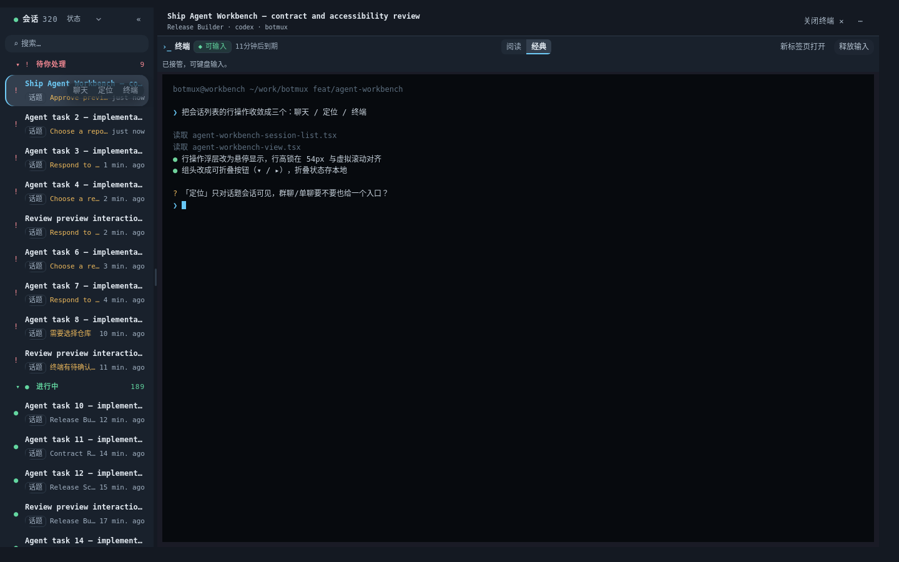

截图使用 320 条合成 session metadata、本地 mock 终端和 1440×900 viewport；sidecar metrics 记录 18 条虚拟列表行（行高 54px）、2 个分组头，终端徽标为「◆可输入」，responsive step 为 full。它不含真实 session、用户、token 或凭据。

## 9. 未验证项与五类人工飞书 Spike

以下项目必须在非生产飞书/Lark 应用、HTTPS 测试域名和专用测试账号上执行。本次没有真实 App ID/Secret、租户、客户端或 platform tunnel，因此全部明确标记为未验证。每个 Spike 都应记录客户端版本、操作系统、时间、screen recording、网络请求状态、JSAPI errno 和最终 UI 状态；证据中不得包含 code、cookie、App Secret 或 access token。

### Spike 1 — PC 行内聊天锚点

前置：发布测试 H5 应用，可信域名指向测试 Dashboard；准备一个有 chatId 的测试会话，窗口宽度至少 1280px。

1. 从飞书 PC appCenter 打开 Full Workbench 并选择该会话。
2. 在客户端调试工具确认行内「聊天」是 target=_blank rel=noopener 的真实锚点，href 指向 applink 域名的 /client/chat/open 且 openChatId 属于当前会话；确认页面没有加载飞书 JS SDK、没有任何 toggleChat/enterChat 调用（不要输出任何身份 token）。
3. 点击「聊天」，观察客户端是否以标准聊天面板打开对应会话（而不是降级的窄容器），Workbench 页面自身不跳转、自有区域仍只含会话列表与终端。
4. 切换 session 后再点聊天，验证 openChatId 跟随当前会话；连续多次打开无重复跳转。

通过条件：客户端以原生方式接管链接并按标准面板放置；页面没有自绘 H5 Chat；工作台不被顶掉；客户端不认 AppLink 时按普通链接打开 applink 页面，不阻塞 Workbench。

### Spike 2 — 普通浏览器与缺失 chatId 降级

1. 在系统浏览器（无飞书客户端）打开同一 Workbench，点「聊天」锚点，确认按普通链接打开 applink 页或唤起客户端，Workbench 页面不受影响，且全程零 JSAPI 调用。
2. 使用没有 chatId 的合成测试会话，确认行内不渲染聊天入口、会话坞显示「无聊天」，不拼接任意 URL。
3. 检查新窗口使用 noopener 语义，URL 中没有 H5 code、cookie 或 Dashboard token。

通过条件：无 SDK 环境安全降级为普通链接；缺 chatId 不出损坏链接；无凭据泄漏。

### Spike 3 — PC sidebar 宽度与 Dock

前置：在开放平台测试版本配置 sidebar AppLink，mode=sidebar、min_width=350、max_width=520，目标为 Dock route。

1. 从 PC 客户端侧边栏打开 #/agent-workbench-dock/<sessionId>。
2. 分别在 350px、400px、520px 观察布局；尝试缩到 350px 以下和扩到 520px 以上，记录客户端实际限制。
3. 验证 Dock 只渲染会话列表、所选会话摘要与「打开聊天 / 终端链接 / 网页链接 / 打开完整工作台」，不渲染任何 pane iframe。
4. 点击「打开完整工作台」，确认目标是 Full Workbench 且 sessionId 编码保持一致。
5. 分别验证 未选择会话（「请选择一个会话」）、无终端（「无终端」）、无网页预览（「无网页预览」）、无聊天（「无聊天」）的占位提示。

通过条件：350–520px 内无横向溢出；Dock 不偷偷渲染 Terminal/Web/Chat pane；appCenter handoff 正确；真实客户端宽度行为有截图和版本记录。

### Spike 4 — iOS/Android 免登与移动布局

前置：一台 iOS、一台 Android，至少一个支持 requestAccess 的当前版本；如可获得旧版本，再覆盖 requestAuthCode fallback。

1. 在飞书内打开 /auth/feishu?returnTo=/#/agent-workbench/<sessionId>，确认 requestAccess 成功后回到目标 session。
2. 在缺少 requestAccess 或返回 errno 103 的客户端确认 requestAuthCode fallback。
3. 用系统浏览器打开同一 H5 URL，确认无 SDK 时 8 秒内进入可重试错误，而不是无限等待。
4. 在约 390×844 与 375×800 竖屏检查下钻栈：会话列表为主页且完整渲染；点行进入详情后「终端 / 网页 / 信息」分段可切换（「网页」仅在会话注册预览后出现），「‹ 会话列表」可返回；触屏终端为只读 viewToken 通道，不显示接管按钮。
5. 覆盖 allowlist 拒绝、provider 失败、网络超时、Retry、前后台切换和 logout；确认迟到 callback 不会越过最新 attempt。

通过条件：成功、失败、超时、无 SDK 都有确定终态；移动页面无不可达控件或横向滚动；失败不设置 session cookie。

### Spike 5 — 真实应用白名单、allowlist 与 SSO 免登

前置：只使用非生产应用；准备 allowlisted 用户 A、未 allowlisted 用户 B 和管理员可查看的服务端审计目录。App Secret 通过 secret manager 注入，不写入仓库、截图或命令历史。

1. A 从飞书入口登录，确认 exchange 返回 200、cookie 为 HttpOnly/SameSite=Lax/Secure、session endpoint 返回 A 的 open_id 和固定 expiresAt。
2. B 登录，确认 403 open_id_not_allowed、没有 Set-Cookie，审计只有 login_denied。
3. 将 A 从 allowlist 移除后重新登录，确认新登录被拒绝；记录现有内存 session 是否按既定运营策略等待到期或主动 logout。
4. A 获取 Terminal control 后执行 logout，确认写 WS 被关闭、control 回 readonly、preview 回锁。
5. 用缩短但仍合法的 H5/Terminal TTL 验证固定到期，不允许 takeover 续期；Dashboard 重启后旧 H5 cookie 应失效。
6. 在反向代理层确认真实 HTTPS Host、Secure cookie 和 WebSocket upgrade；检查日志、审计、浏览器 URL、SSE 与 screenshot 均无 secret/code/token。

通过条件：A 成功、B 精确拒绝；cookie 与到期符合配置；logout/expiry/restart 都回收能力；服务端和浏览器证据无秘密泄漏。

## 10. 仍需运营决策

- 审计文件保留期、轮转、采集失败告警，以及是否从默认 best effort 提升为输入路径 fail closed。
- 真实飞书/Lark 客户端最低版本与 requestAccess/requestAuthCode 支持矩阵。
- 同源 Preview 只承载受信本机开发应用；若需求扩展到不可信应用，先设计独立 origin 和隔离容器。
- 生产部署、真实凭据、开放平台发布与 live daemon 操作必须走独立变更审批，不属于本交付。

## 11. 外观系统与视觉重构

> 本节为 2026-08-18 追加，记录外观系统（四主题 + 跟随系统 + 终端双渲染）、常驻链接入口与视觉体系重构的实现要点与验收方式。原文 1–10 节结构不变。

### 11.1 外观系统

**状态模型**（`src/dashboard/web/agent-workbench-appearance.ts`）：

- 一条 localStorage 记录 `botmux.agent-workbench.appearance.v1` 存三件事——`skin`（4 选 1）、`mode`（system/light/dark）、`termStyle`（reader/classic），永远一起读一起写。
- 4 套配色：`ink`（墨黑）、`slate-blue`（蓝灰，默认）、`warm-graphite`（石墨）、`light-frost`（冷白）。浅色族只有 light-frost 一套，`mode` 落到 light 时恒用它。
- 终端双渲染：`reader`（阅读，低饱和 + 行距 1.15，配色跟随当前 skin）与 `classic`（经典，Tokyo Night 原样 + 行距 1.0，默认）。
- 旧偏好自动迁移：首版命名 `orca-ink` / `orca` 读到时静默换成 `ink` / `reader`，normalize 是唯一入口（load / save / 跨 tab storage 事件三路一致）。
- 生效值写到文档根 `data-skin` / `data-theme`，CSS 侧靠属性选择器整体换档；工作台挂载期间接管这两个属性，卸载时把进来之前的值原样还回全站机制。
- 跨 tab 同步靠 `storage` 事件；跟随系统靠 `matchMedia('(prefers-color-scheme: dark)')` 的 change；系统明暗变化时幂等盖回自己的解析结果，不额外重绘。

**入口（三处同一状态源）**：

- 桌面 / 会话坞：工作区头部 `⋯` 菜单 →「外观」（`WorkbenchAppearanceMenu`，下拉浮层）。
- 移动端：会话列表页顶栏 `◐` 图标 → 底部 sheet（`WorkbenchAppearanceSheet`，同一块面板内容）。
- 终端标题栏：「阅读｜经典」分段控件（`WorkbenchTermStyleSegment`），只切 termStyle。

**终端 iframe 下发**：终端画布跑在跨文档的 `/s/<sessionId>` iframe 里，父页换 class 传不进去。父页通过 `postMessage`（type `botmux:wb-appearance`，targetOrigin 从 iframe URL 推导，绝不用 `*`）把 `{ termStyle, skin, theme }` 推给终端页；终端页只认父窗口发来的、12 个键齐全且每个都是十六进制色值的载荷，其余一律丢弃。

**无障碍**：色板与分段控件为 radiogroup/radio + roving tabindex，方向键在组内移动；`⋯` 菜单有 haspopup/expanded，Esc 关闭并归还焦点。localStorage 不可用时只在当前页生效且不弹错，脏值与未知枚举逐字段回落默认。

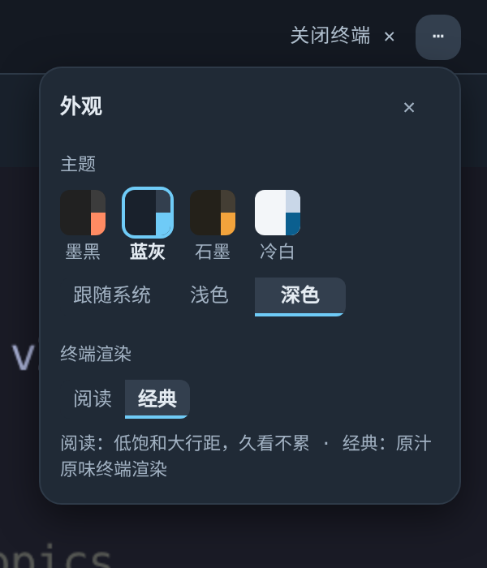

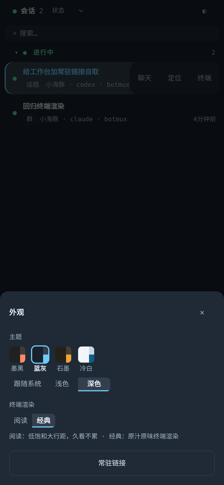

### 11.2 四主题实测截图

以下截图来自隔离实例的合成数据（无真实会话、用户或凭据），展示四套配色的实际效果：

| 墨黑（ink） | 蓝灰（slate-blue，默认） |
|---|---|
| 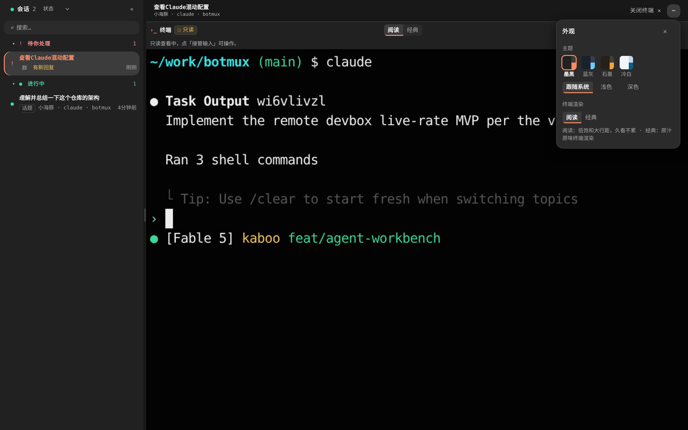 | 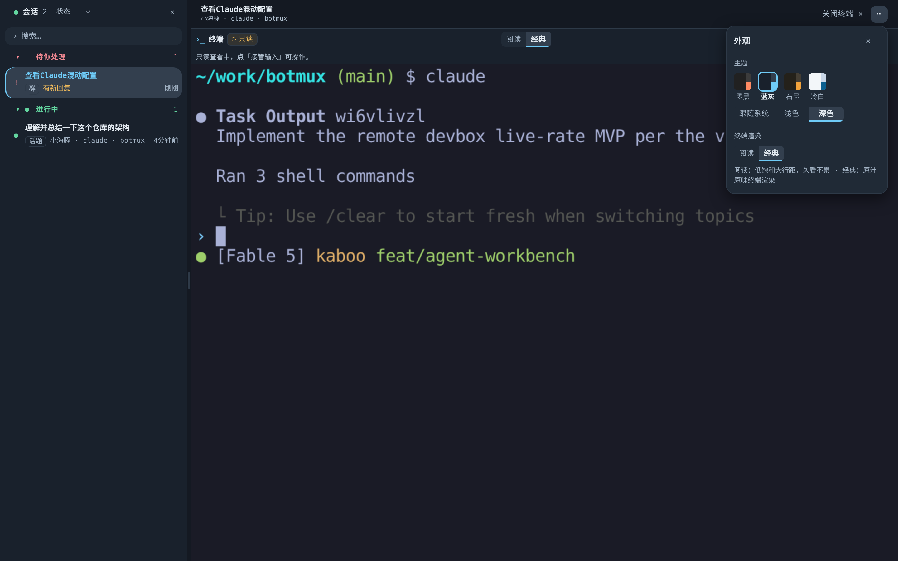 |

| 石墨（warm-graphite） | 冷白（light-frost） |
|---|---|
| 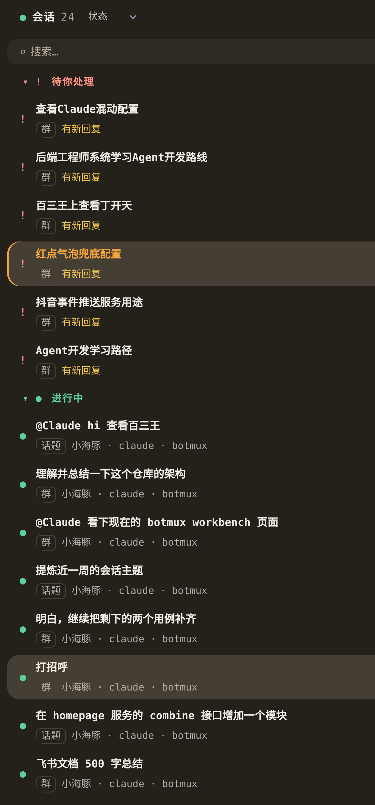 | 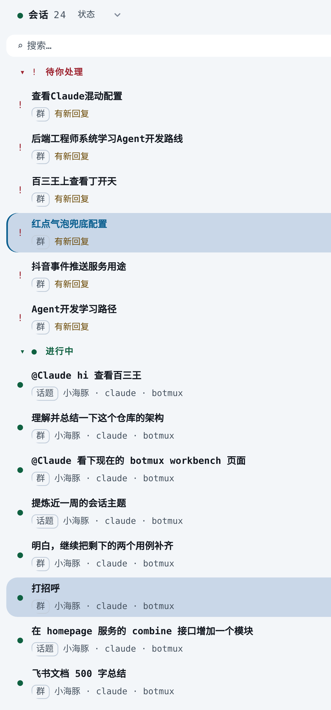 |

### 11.3 终端双渲染

「阅读」与「经典」的外框几何完全一致，切换只重绘画布 + 一次 `fit()`，不影响连接和接管状态。

| 阅读（reader） | 经典（classic，默认） |
|---|---|
| 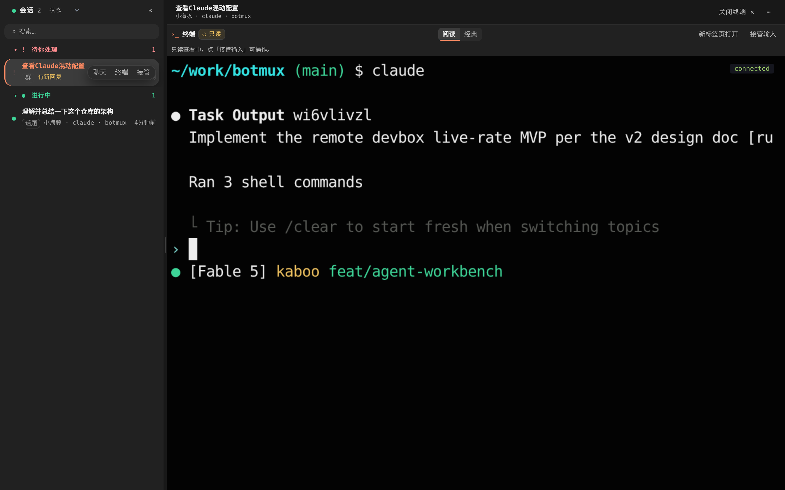 | 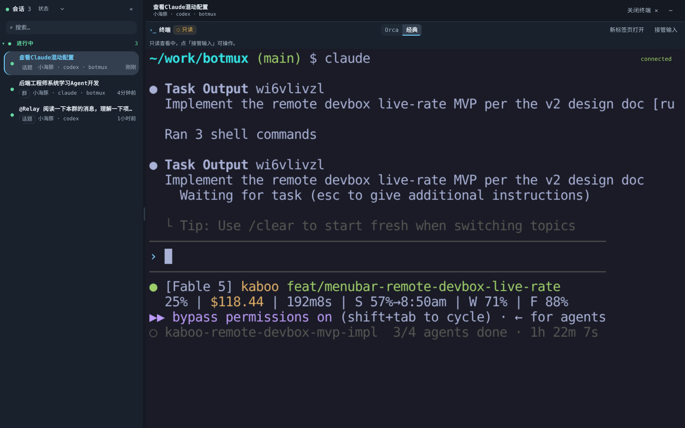 |

### 11.4 常驻链接入口

**`/dashboard` 卡片**（`src/core/workbench-link.ts` + `src/im/lark/overview-card.ts`）：

- 「打开工作台」按钮改为携带长期 Dashboard token 的常驻链接（产品决策反转，短票机制 `dashboard/workbench-ticket.ts` 原样保留但不再被卡片调用）。
- PC 走 appCenter AppLink（`mode=appCenter`，可右键固定到侧边栏），移动端走裸 URL（手机客户端不识别 applink mode）。
- 卡片正文不渲染明文链接行（曾短暂上过一版后撤下），只有按钮 + 一行小字提示（常驻不过期 + rotate 自救）。
- token 读不到时 fail open 成无凭证裸链接，小字改说「需自行登录」。

**工作台内 owner 自取**（`src/dashboard/standing-link.ts` + `WorkbenchStandingLinkPanel`）：

- `GET /api/workbench/standing-link`：只有本机完整管理身份（legacy-dashboard cookie）可取，路由级 + 处理器级两层门禁；飞书 H5、平台 owner/teammate/guest、匿名一律 404。
- 同源校验（`Sec-Fetch-Site` / `Origin`，Referer 兜底）、响应 `no-store`、每发一次落一条 `auth.standing_link_issued` 审计（审计写不进去就不发链接）。
- 前端入口挂在 `⋯` 菜单（桌面）和 `◐` 底部 sheet（手机）的「常驻链接」面板，只对 `manageAuthed` 身份渲染。

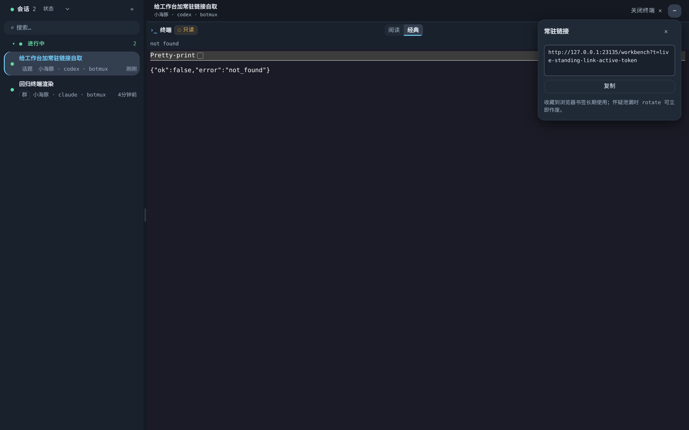

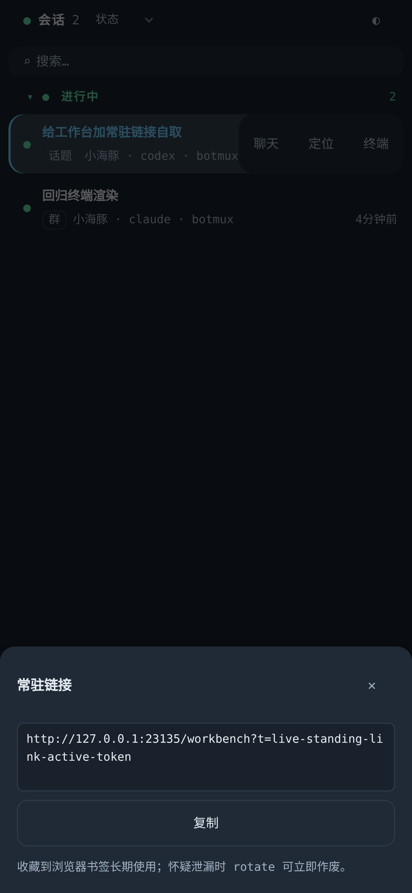

### 11.5 视觉体系重构

- **分层配色**：四层底（L0 页面底 / L1 侧栏 / L2 卡片浮层 / L3 选中悬浮）+ 三档文字 + 语义色；历史 `--wb-*` 令牌全部映射到新令牌，换配色只改一处。
- **圆角三档**：从 4/8/10/12 四档收成 6/10/14 三档 + 仅用于正圆的 full，读全站 `:root` 统一令牌。
- **实线白名单**：分栏竖线、5px 实心分隔带、面板描边全删，分区改由底色差 + 透明握把带表达。
- **终端原生全铺**：面板去描边、去圆角、去阴影，底色改终端画布色；标题栏贴 L1 满出血且无下沿线；8px 左安全边距由外壳 padding 给。
- **手机字号自适应**（`e35a4d44`）：终端页 xterm fontSize 不再写死 14px，改为按容器宽度反推（目标 62 列，`width / (62 × 0.6)`，半档取整，只缩不放，硬边界 [9,15]），接在 resize / orientationchange / ResizeObserver 三个触发源上，250ms 防抖。桌面宽度 ≥ 约 521px 仍是 14px，存量渲染零变化。

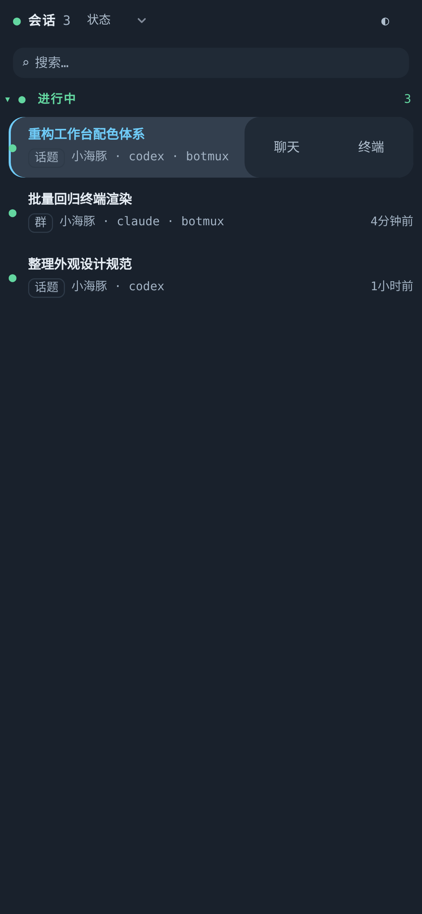

### 11.6 验收方式

- 外观单测覆盖：normalize / migrate / select 规则、跨 tab storage 事件、系统明暗变化、localStorage 不可用降级。
- 终端接缝集成测试：真实载荷跑终端页监听器，含冒充来源、错类型、脏色值、缺键的拒绝路径。
- 契约测试：四套皮肤 15 个色值逐项锁死、圆角三档白名单。
- 常驻链接：路由级 401/404、处理器级 404、跨站 403、审计失败 503、token 轮换后链接自然更新。
- 浏览器实测：上述截图均来自隔离实例（合成会话数据，无真实敏感信息），覆盖桌面 / 手机、四主题、双渲染、外观面板、常驻链接面板。

### 11.7 终端控制权：acquisition 端到端收口

写租约挂在（会话 × 登录）上，**不**挂在面板上：同一个登录里第二块面板接管，服务端给的是同一把租约。因此「我这次接管的回执迟到了、面板却已经没了 → 把租约还回去」这条补偿，在服务端看来与正常释放完全同形，实际却会把用户此刻正在打字的那块终端的写权限收走。收口方案是让**客户端在 POST 之前**生成一次性的 acquisition id，端到端贯穿四段：

1. **takeover POST**：`?acq=<id>`，服务端把它绑定到本次接管（形状不合法直接 400，不静默降级——静默降级会发出一把调用方无法补偿的租约）。
2. **状态回读**：`GET /control` 对持有者返回当前的 `acquisition`，面板据此判断「还是不是我那一次」。
3. **补偿释放**：`?expect=<id>` 的条件释放（CAS），不匹配返回 `control_lease_superseded` 且租约原封不动。分发收进 `src/dashboard/terminal-control-route.ts`——生产 dashboard 与两个验收脚本调的是同一份，此前脚本读了 `?expect=` 而生产没读，条件释放在真链路上等于不存在。
4. **WS 注册 / 断开**：前置代理按 acquisition 注册可写 socket，`disconnect` 也只对**当前** acquisition 生效；同登录接管轮换 acquisition 之后，旧面板 socket 断开不再拆掉新面板刚拿到的租约。

关键在于 id 由客户端先生成：服务端生成的标记只随成功响应返回，最需要它的「服务端已受理、响应丢失」分支恰恰拿不到；事后再 GET 一次「当前标记」拿到的可能是别的标签页那一次，用它补偿就是精准误删。

配套的三处收口：

- **关面板 = 放弃这次接管**：接管已回执、但新的 iframe/WS 还没连上就关掉终端时，既没有在途 promise 可补偿、也没有已注册的 socket 会触发 disconnect，租约会一路挂到 TTL。面板卸载时按自己确认过的 acquisition 做一次可重入的条件释放（恒可写身份除外）。
- **首屏未知不挂 iframe**：首个控制权 GET 还没回来时，同一个登录留下的旧租约会让这块 iframe **真的能打字**。能握租约的通道（authenticated + canControl，含随后才被识别为 fixed 的平台 owner）在 loading 期间不挂 iframe，改显「正在确认终端控制权」；无 canControl / 无凭证的只读通道照旧直挂。
- **观察读数的盖写基准**改成「已发起的写 epoch」（写失败也推进）。写失败正是最需要 unknown 防线的场景（回执丢了、服务端很可能已受理），用「已结算成功」当基准时，接管之前发出的旧 poll 会在写失败清掉 pending 之后把 unknown 一把抹回只读。

### 11.8 终端写权限信号：带外首帧

「这条 WS 到底能不能写」以前混在 PTY 字节流里（OSC 1989 `write`），而且终端页对**每一帧**都扫一遍——只读终端里跑个 `printf` 打出同样的字节就能把 `wsHasWrite` 翻成 true（反向则是把自己打成只读的 DoS）。现在改成带外控制帧（`src/core/terminal-write-frame.ts`）：

- worker 在注册这条 socket 的同一个同步 tick 里把它作为**第一条消息**发出；
- 终端页只在「本连接的第一帧」上尝试解码，且要求**整帧精确匹配**，解出即锁存，之后的字节永远只是 PTY 输出；
- 每次重连先把结论退回未知（并把这个「未知」上抛给嵌入方）；
- 解码只有一份实现，终端页把它的源码原样内嵌（那段页面代码住在模板字符串里，import 不进来），单测跑的就是页面里真正执行的那一份。

工作台侧同步收紧：`readTerminalFrameWrite` 只认已建立的 WS，不再拿页面那次 HTTP GET 的 `hasToken` 兜底——两次是各自独立的鉴权（iOS WebView 的 WS 升级不带 Cookie），兜底等于在连接还没建立时宣称「可以输入」。短时 viewToken 换链时，链接换代计入 iframe/watcher 的 key（只存计数，token 不进 DOM），旧连接的结论立刻作废回未知。
