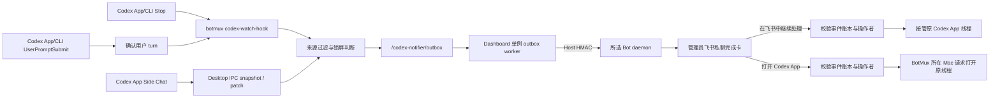
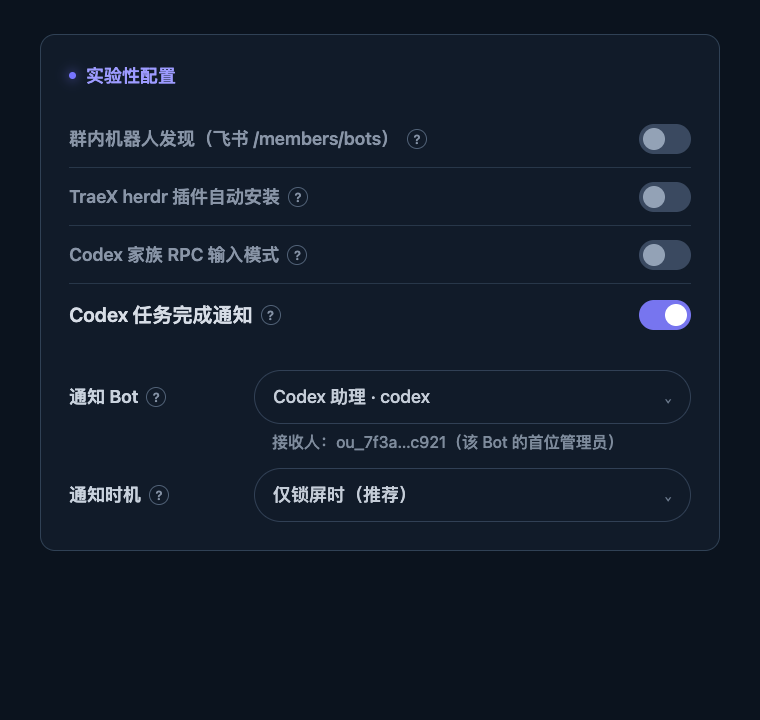
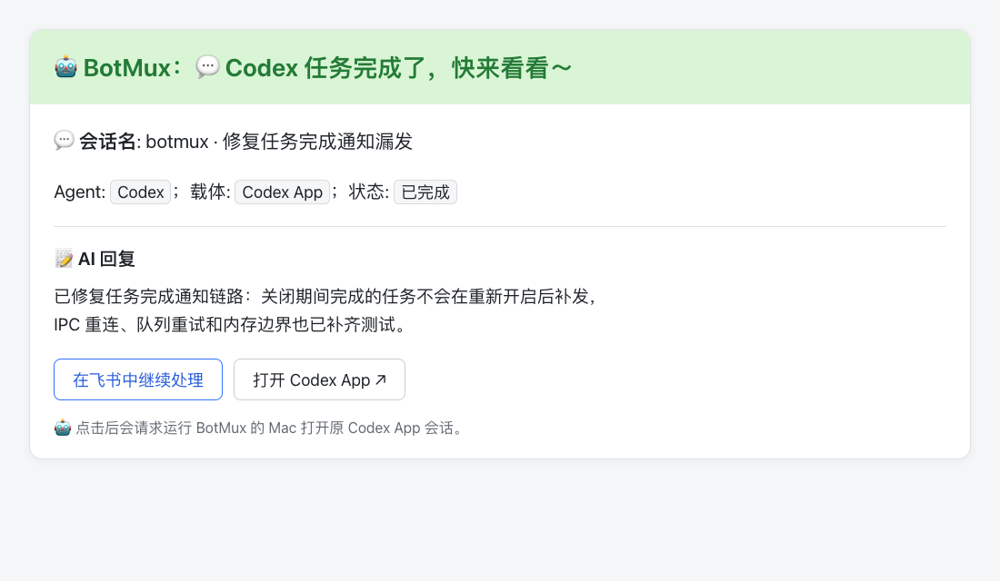

# Codex 独立任务完成通知

本文说明 BotMux 内建的 Codex App/CLI 完成通知能力，供后续维护、测试和迁移使用。该能力是机器级实验功能，默认关闭，不依赖插件服务。

## 目标与边界

- 普通 Codex App/CLI 通过 `UserPromptSubmit` 与 `Stop` Hook 采集；不触发 Hook、也不落 rollout 的 Codex App Side Chat 通过本机 Desktop IPC 补充采集。两条路径都只为用户发起的回合向所选 Bot 的管理员发送飞书私聊完成卡。
- 卡片展示项目、用户问题、任务状态和最终 AI 回复。识别为 Codex App 且线程 ID 合法时，管理员可通过飞书回调请求运行 BotMux 的 Mac 打开原会话，也可在飞书中接管后继续处理。
- Side Chat 是 `ephemeral` 临时会话，没有可供 BotMux 恢复的 rollout；其完成卡只同步结果，不展示接管或打开 App 按钮。
- BotMux 自己管理的 Codex 会话和子 Agent 不重复通知。
- Hook 只采集和可靠入队，不直接访问飞书，也不等待 daemon 或网络。
- 本功能不负责把 Dashboard 或可写终端暴露到公网。打开 App 的回调只携带事件 ID，由 daemon 从本地账本恢复线程 ID，再在同一 macOS 用户会话中调用系统 URL handler。即使从移动端发起，Codex App 也只会在运行 BotMux 的 Mac 上打开。

## 核心架构



主要模块：

| 模块 | 职责 |
| --- | --- |
| `src/features/codex-notifier/hook-installer.ts` | 幂等合并 Codex `UserPromptSubmit` 与 `Stop` Hook，保留其他 Hook 和已信任命令 |
| `hook-cli.ts`、`confirmed-turn.ts`、`internal-turn.ts` | 持久化精确用户 turn，过滤 Codex 内部后台任务，Stop 完成处理后消费证明 |
| `codex-context.ts`、`screen-lock.ts` | 识别 App/CLI、从 transcript 回填当前回合、判断通知时机 |
| `side-conversation-monitor.ts` | 发现临时 Side Chat，跟踪 Desktop IPC revision，并把完成状态转换为统一事件 |
| `event.ts`、`types.ts` | 构造稳定事件 ID，执行严格的跨进程事件校验 |
| `outbox.ts`、`outbox-worker.ts`、`worker-lock.ts` | 原子落盘、跨 Dashboard 独占消费、顺序投递、失败重试和运行状态记录 |
| `emitter.ts` | 通过主机 IPC 鉴权把事件交给目标 daemon |
| `event-store.ts`、`card.ts` | daemon 侧事件账本、幂等投递和飞书完成卡 |
| `src/dashboard/web/settings-page.tsx` | Dashboard 的实验开关、目标 Bot 和通知时机配置 |

Dashboard 进程持有 outbox worker。`worker.lock` 通过 PID 锁保证即使误启动多个 Dashboard，也只有一个进程消费；Side Chat monitor 也只在同一 lease 持有者中运行，避免多个 Dashboard 重复监听和入队。新鲜但尚未写完的锁文件会保留一个初始化宽限期，崩溃遗留锁会在 PID 消失或损坏锁超过宽限期后回收，滚动重启时新进程会持续重试直至接管。不要再为该能力增加独立 PM2 插件服务。

## 机器级配置

配置保存在 `~/.botmux/config.json` 的顶层 `codexNotifier`，不属于任意单个 Bot：

```json
{
  "codexNotifier": {
    "enabled": true,
    "targetBotAppId": "<lark-app-id>",
    "notifyWhen": "locked_only"
  }
}
```

| 字段 | 默认值 | 说明 |
| --- | --- | --- |
| `enabled` | `false` | 实验开关；只有显式设为 `true` 才采集和投递，也只有开启时允许完成卡远程请求主机打开 Codex App |
| `targetBotAppId` | 无 | 必须显式选择已配置的 Codex / Codex App Bot；该 Bot 负责私聊其管理员并接管会话 |
| `notifyWhen` | `locked_only` | `locked_only` 仅锁屏时通知；`always` 始终通知，适合调试或明确需要飞书通知的场景 |

推荐从 **Dashboard → 设置 → 实验性功能** 修改配置。功能关闭时只显示主开关；点击开启后展开通知 Bot、通知时机和接收人。若配置尚不完整，Dashboard 会先保持待启用状态，等用户补全必填项后自动开启，已经保存的选项不会被清空。Dashboard 会展示所选 Bot 的首位管理员（脱敏），并要求在线 daemon 已将其解析为当前 Bot 可用的 `open_id`；Hook、目标 daemon、worker 和投递队列均正常时保持静默，只在用户需要处理异常或消息积压时显示提示。开启前还会校验平台并安装 Hook。`locked_only` 目前只在 macOS 上开放，非 macOS 可显式选择 `always`。



## 产品效果

识别为普通 Codex App 会话的完成卡同时提供“在飞书中继续处理”和“打开 Codex App”两个入口。后者通过可信 callback 请求运行 BotMux 的 Mac 打开原会话，不会尝试在点击卡片的设备上打开 Codex App。移动端属于待真机验收的触发入口，不在卡片文案中承诺。Side Chat 完成卡标记载体为 `Codex App Side Chat`，只展示结果。



## Hook 生命周期

1. 开启功能时，Dashboard 幂等安装或修复 `~/.codex/hooks.json` 中的 `UserPromptSubmit` 与 `Stop` Hook。
2. 安装器保留 Flux 等其他 Hook，并去重历史 BotMux Hook。若用户已经信任且仍可执行的 `codex-watch-hook` 命令，则保持该命令字节不变，避免重复触发 Codex 信任确认；失效命令会自动修复。
3. Hook 命令名保持 `botmux codex-watch-hook`，这是旧插件迁入 core 的兼容契约。
4. 关闭功能时不删除 Hook。Hook 会快速返回 `disabled`，不读取回合、不产生新事件；保留 Hook 可以避免反复开关导致重复信任。
5. 功能关闭时 worker 也暂停投递，已有 outbox 文件保留；再次开启后继续投递。

Dashboard 启动时会对已开启配置再次执行 Hook reconcile。也可以用以下命令诊断：

```bash
botmux codex-watch-install-hook
botmux codex-watch-status
```

`codex-watch-status` 只输出生效配置、Hook 状态和待投递数量，不读取 Codex transcript。

新安装的 macOS/Linux Hook 会把当前 BotMux 所用 Node 目录写入稳定 `PATH`，避免锁屏后图形应用环境找不到 `node`；Windows 使用 `~/.botmux/bin/botmux.cmd`。安装状态不仅检查命令文本，也检查 shim 和 Node 是否仍可执行。

## 事件采集与过滤

`UserPromptSubmit` 会为精确的 `session_id + turn_id` 写入 `0600` 来源证明；`Stop` 只有命中该证明，或能从 transcript 回填同一 turn 的真实用户问题时才允许通知。完成投递或确定跳过后删除证明，只有入队失败才保留供重试。这样 daemon 重启、历史会话恢复或 Codex Desktop 后台线程结束时，不会仅凭一个新的 `Stop` 误发历史内容，也不会长期积累已结束 turn 的证明。

Hook 最多读取 transcript 首部 256 KiB 和尾部 4 MiB：首部只解析第一条完整 `session_meta` 以识别 Codex App/CLI 以及 internal/subagent 来源，尾部只提取当前 turn 的用户问题和最终回复兜底；不会把完整 transcript 写入 outbox。完成卡中的最终回复最多保留 6500 个字符。

以下任务不会通知：

- 环境中存在 `BOTMUX_SESSION_ID` 的 BotMux 托管会话；
- `agent_id` 与 `session_id` 不同的子 Agent；
- 没有真实 `UserPromptSubmit` 且无法从 transcript 回填用户问题的未确认 `Stop`；
- 标题/描述、ambient suggestions、审批审查、Memory、PR/commit/summary 等 Codex Desktop 内部任务；
- `session_meta.source` 标记为 `internal` 或 `subagent` 的后台会话；
- 功能关闭、未选择目标 Bot，或不满足通知时机。

Codex App 会为普通桌面输入附带不透明的 `client_id`，该字段不能作为稳定来源标记。当前只把匹配 Hook `session_id`、`session_meta.payload.source === "vscode"` 且 `originator === "Codex Desktop"` 的会话识别为 Codex App；`exec` / `cli` 识别为 Codex CLI，未知值 fail closed，不展示 App 深链。托管会话只使用 BotMux 显式注入的 `BOTMUX_SESSION_ID` 过滤。

macOS 锁屏探测读取 IORegistry 的 `CGSSessionScreenIsLocked` / `IOConsoleLocked`。明确解锁时不通知；macOS 探测异常时按锁屏处理，避免静默漏报。非 macOS 的 `locked_only` 返回不支持，不会悄悄退化成 `always`。

事件 ID 只由 `source + threadId + nativeTurnId + status` 计算，不包含完成时间，因此 Hook 重试仍得到同一事件。入队时会把 `targetBotAppId` 固化到 envelope；之后即使 Dashboard 改了目标 Bot，已经排队的事件仍投递到原目标。

### Side Chat 补充采集

Codex App Side Chat 不调用用户配置的 Hook，状态也不会写入 rollout。macOS 上的单例 monitor 会从 Codex 预创建的 `~/.codex/visualizations/YYYY/MM/DD/<threadId>` 目录发现近期候选线程，再通过 `~/.codex/ipc/ipc.sock` 订阅本机线程流：

- 首个 snapshot 用本次启用时间作为水位，不补发此前已经结束的历史会话；
- 线程若在首次 snapshot 前快速结束，只在精确完成时间晚于水位时补发其中最新的终态 turn；
- 后续只把 `inProgress → completed/failed/interrupted` 转换为完成事件；
- 只有同时标记 `sideConversation: true` 与 `ephemeral: true` 的状态会进入通知链路，普通线程和子 Agent fail closed；
- patch revision 不连续、结构不完整或 IPC 断开时重新请求 snapshot；IPC 不可用时静默重连，不影响 Hook 与 outbox worker；
- 完成事件沿用同一锁屏判断、固定目标、outbox、daemon 账本和飞书幂等链路。

Side Chat 在持久入队暂时失败时只保留有界的内存重试集合；达到事件数或字节上限会明确记录告警，避免磁盘故障演变成 Dashboard 进程的无界内存增长。

该 IPC 是 Codex Desktop 的本机内部接口，可能随 App 版本变化，因此 Side Chat 支持仍属于实验能力。实现限制在 macOS，解析严格且失效时只影响 Side Chat 补充采集，不会降级为扫描或上传 Codex 会话文件。

## 投递、重试与幂等

- Hook 以 `0700` 目录、`0600` 文件原子写入 `<dataDir>/codex-notifier/outbox/<eventId>.json`，不等待 daemon；损坏文件会移入 `dead-letter`，不会永久占住同一事件。
- Dashboard worker 按文件时间顺序处理，每轮最多尝试 50 条或运行约 30 秒；连续网络故障不会让一次批次长期占住 heartbeat 和后续轮询。
- 单次 daemon IPC 最多等待 15 秒；超时或 Dashboard 退出会中止请求并保留事件重试，避免一个挂起的飞书请求堵住整条队列。
- 投递失败从 2 秒开始指数退避，最长 60 秒；目标 daemon 离线或飞书暂时失败时不删除文件。
- daemon 返回 `accepted` 或 `duplicate` 后才删除 outbox 文件。
- worker 状态保存在 `<dataDir>/codex-notifier/worker-state.json`，记录 heartbeat、pending、最近错误和累计结果；Dashboard 的 pending 始终实时读取 outbox，heartbeat 超过 90 秒会显示 worker 离线。
- daemon 为每个 Bot 保存最近 1000 条完整事件，并额外保存最近 10000 条已送达的精简回执。精简回执移除用户问题和 AI 最终回复，只保留旧卡接管校验和幂等投递所需字段；schema v1 账本可直接读取，并在下一次写入时升级为 v2。
- 飞书消息 UUID 由事件 ID 派生。进程内并发合并、完整事件/精简回执去重和飞书 UUID 共同避免重复消息。

## 安全边界

- 事件入口只接受主机 Host HMAC 鉴权请求，不对外部网络开放匿名投递。请求携带完整 outbox envelope，daemon 还会校验其中固定的 `targetBotAppId` 与自身一致；迁移期旧 `/api/plugin-events` envelope 也执行相同目标绑定，避免端口复用时错投给其他 Bot。
- 事件 schema 严格拒绝额外字段、危险属性和超过 64 KiB 的 payload；Codex 原生事件还会校验事件 ID 与原生身份一致。
- App/CLI 来源在 outbox envelope 中单独保存，落盘的 v1 事件本体保持旧 worker 可读；升级窗口中的旧 worker 最多退化为不展示 App 深链，不会把完成通知当作损坏事件隔离。
- Side Chat 标记同样保存在兼容 envelope；daemon 即使收到伪造的旧按钮回调，也会拒绝接管或打开临时线程。
- Hook 和 outbox 不持有飞书凭证。只有目标 Bot daemon 可以解析管理员身份并发送私聊。
- “在飞书中继续处理”和“打开 Codex App”回调都只携带 `event_id`。卡片不会携带线程 UUID、`codex://` URL、完整工作目录或终端写令牌。
- 点击任一按钮时，daemon 都会同时校验操作者是该 Bot 管理员、卡片消息 ID 与事件账本一致，再从本地账本恢复真实事件。打开 App 还会实时校验实验开关、目标 Bot、事件已投递、Codex App 来源和线程 UUID。
- 打开 App 固定使用 macOS `/usr/bin/open -u codex://threads/<threadId>`，不经过 shell；非 macOS 主机不展示按钮。成功回调只表示系统接受了打开请求，不证明 Codex App 已定位到正确线程。
- 该按钮会从飞书远程激活运行 BotMux 的 Mac 上的 GUI，属于实验开关明确授权的本机副作用。机器必须保持醒机、联网，daemon 必须运行在同一 GUI 用户会话中；睡眠、注销、headless 或切换到其他 macOS 用户不属于支持范围。
- 卡片会把用户问题和最终 AI 回复发送到飞书，属于显式 opt-in 的数据边界；维护者新增字段前必须重新评估敏感信息范围。

当前 callback 版本发出的可信完成卡在关闭实验开关后仍可点击接管，但不能再请求主机打开 Codex App。开发期已经发出的旧 `open_url` 直链卡不经过 daemon，无法由开关撤销，应忽略或删除。这样既保留已送达任务的飞书处理入口，也能撤销新版卡片远程激活 GUI 的授权。

## 测试与验收

最小验证：

```bash
pnpm exec vitest run --project unit test/codex-notifier*.test.ts
pnpm build
```

相关单测至少应覆盖：

- UserPromptSubmit + Stop Hook 合并幂等、其他 Hook 保留和无效 JSON 不覆盖；
- 精确 turn 来源证明、未确认 Stop、内部 Prompt/session_meta、BotMux 托管会话和子 Agent；
- 锁屏/解锁和非 macOS 分支；
- 事件 schema、稳定 ID、大小限制和危险字段拒绝；
- outbox 原子入队、重复入队、成功删除、失败保留与退避；
- 飞书消息幂等、仅管理员可接管、伪造卡片消息 ID 被拒绝；
- Dashboard 的默认关闭、目标必填、平台限制和部分配置更新。
- Side Chat snapshot/patch 状态转换、首次基线、快速完成恢复、危险 patch 路径拒绝和候选目录边界。

手工验收建议：

1. 在 Dashboard 选择测试 Bot，把通知时机临时设为 `always` 后开启。
2. 运行一个不由 BotMux 管理的 Codex App 任务。
3. 确认所选 Bot 的管理员收到一条私聊卡，项目/问题/最终回复正确且项目名没有重复，并展示“打开 Codex App ↗”。
4. 分别在飞书桌面端和移动端点击“打开 Codex App ↗”，确认飞书提示已向运行 BotMux 的电脑发送请求、daemon 记录请求成功，且 Mac 打开的是原 `threadId`。
5. 点击“在飞书中继续处理”，确认仍可接管原 `threadId`，且只在完成通知的话题内创建一张会话卡；需要可写终端时，再点击会话卡内的“获取操作链接”或发送 `/term`。
6. 再运行一个 `codex exec` / CLI 任务，确认载体显示为 Codex CLI 且不展示 App 深链按钮。
7. 关闭实验开关，确认旧卡仍可接管，但“打开 Codex App”被拒绝；再重新开启。
8. 恢复 `locked_only`，分别验证“屏幕解锁不通知”和“真实锁屏会通知”。锁屏时保持机器醒机联网，从手机点击打开按钮，解锁后确认仍定位到原线程；真实锁屏路径不能只用 mock 结果代替。
9. 用 `botmux codex-watch-status` 和 `worker-state.json` 核对 outbox 已清空且最近投递成功。
10. 新建一个 Codex App Side Chat，确认结束后收到一张标记 `Codex App Side Chat` 的结果卡，且卡片不展示“继续处理”或“打开 Codex App”。

Dashboard 或卡片 UI 有改动时，按仓库规范在 PR 中附实际截图。

## 从独立插件迁移

旧实现使用 `codex-watch` 插件 outbox、独立 PM2 worker 和 `/api/plugin-events`。迁入内建能力时遵循以下顺序：

1. 升级到包含内建能力的 BotMux，并在 Dashboard 选择原目标 Bot 与通知时机后开启。内建配置尚不存在时，`codex-watch-hook` 会继续代理已启用的旧插件，避免升级窗口静默停采集；保存内建配置后由 core 接管，无需修改已信任命令。
2. 让旧插件 worker 先排空 `~/.botmux/plugins/codex-watch/outbox`。内建 daemon 暂时保留 `/api/plugin-events` 兼容入口，只用于迁移期历史事件。
3. 确认旧 outbox 为空、内建链路已成功投递后，停止并卸载旧插件：

   ```bash
   botmux plugin service stop codex-watch
   botmux plugin uninstall codex-watch
   ```

   `plugin disable` 只关闭插件能力，不会改变 manifest 中 `mode=auto` 的独立 host service；保留安装记录会让它在下次 `botmux start/restart` 时重新拉起。若旧插件通过 `--link` 安装，卸载只移除 `~/.botmux` 下的安装记录，不删除原源码仓库。

4. 再次运行新的独立 Codex 任务，确认事件只进入 `<dataDir>/codex-notifier/outbox`，且只收到一条通知。
5. 至少跨一个稳定发布周期确认没有旧客户端后，再删除 `/api/plugin-events` 兼容入口；该改动应单独提交，并在 release note 中说明破坏性变更。

迁移期间不要同时保留两个会消费同一 outbox 的 worker，也不要删除 `codex-watch-hook`；这个命令名已经成为 core 的稳定兼容入口。

## 维护不变量

后续扩展应保持以下约束：

1. Hook 永远只做有界采集和本地可靠入队，不访问飞书。
2. 事件 ID 不依赖当前时间，重试和进程重启必须保持幂等。
3. 未确认的 Stop 必须 fail closed；不能仅凭最终回复 JSON 形状推断用户任务。
4. outbox 项固定目标 Bot；重试期间不按最新配置改投其他管理员。
5. 只有 Dashboard 单例消费 core outbox。
6. 身份、卡片来源和事件真实性必须在 daemon 服务端校验，不能信任回调携带的业务字段。
7. `locked_only` 在不支持的平台必须显式拒绝或跳过，不能静默变成始终通知。
8. App 深链必须同时满足可信 `session_meta` 来源和 UUID 线程 ID；识别失败时只保留飞书接管入口。
9. Side Chat 只允许结果通知；在 Codex 提供稳定的持久化与导航协议前，不伪造接管或深链能力。
