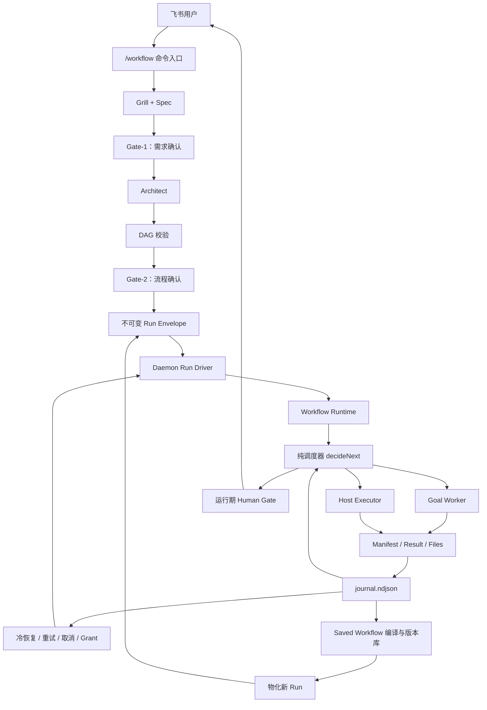
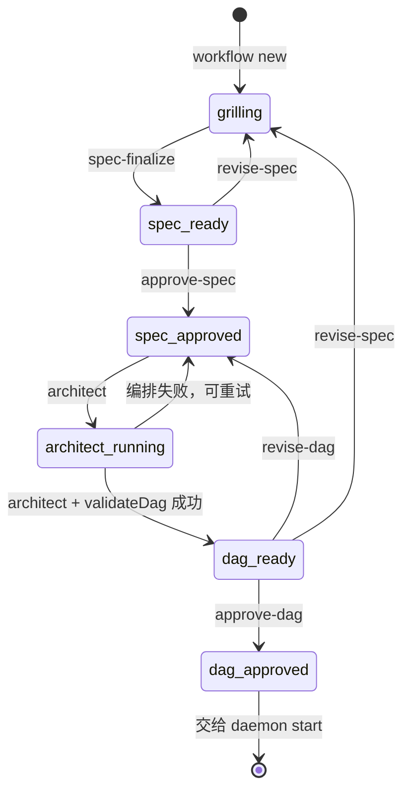
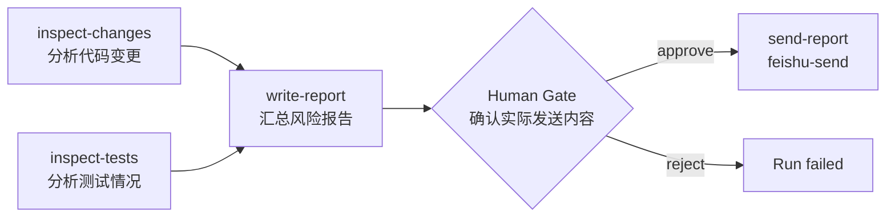

# Botmux Workflow v3 当前实现设计

> 本文描述 Botmux 当前源码中的 Workflow v3，而不是早期 v0.2 模板引擎。面向维护者、功能开发者和需要排查运行问题的 Agent。涉及行为判断时，以本文链接的实现代码为最终依据。

## 1. 目标与边界

Workflow v3 用来完成一个有界、可拆分、执行后即结束的复合目标。用户只需要给出自然语言目标，系统负责：

1. 逐步澄清需求并形成结构化 Spec。
2. 把 Spec 编译为有向无环图（DAG）。
3. 在需求和流程两个边界请求人工确认。
4. 按依赖关系并发调度节点。
5. 用临时 Agent CLI Worker 执行 LLM 节点，用受信 Host Executor 执行确定性副作用。
6. 用结构化产物而不是模型口头回复判定节点成功。
7. 将运行过程写入追加式事件日志，使审批、重试和 daemon 重启可恢复。
8. 将一次成功运行固化为带版本、参数和权限范围的 Saved Workflow。

Workflow 适合“调研多个来源后生成报告”“实现后测试并返工”“汇总数据后审批发送”等任务。长期存在、跨多个话题持续协调的多 Bot 项目不属于这一模型。

## 2. 架构总览

Workflow 分为创作控制面、运行数据面、交互与恢复面、模板库四部分：



关键模块：

| 职责 | 实现 |
|---|---|
| 飞书命令解析 | `src/im/lark/workflow-slash-command.ts`、`v3-saved-workflow-command.ts` |
| 创作状态机 | `src/workflows/v3/host.ts`、`grill-state.ts`、`spec.ts` |
| Architect | `src/workflows/v3/architect.ts` |
| DAG Schema 与校验 | `src/workflows/v3/dag.ts`、`dag-loader.ts` |
| 纯调度决策 | `src/workflows/v3/orchestrator.ts` |
| Runtime | `src/workflows/v3/shared-node-runtime.ts`、`runtime.ts` |
| 临时 Worker 池 | `src/workflows/v3/ephemeral-pool.ts` |
| 产物契约 | `src/workflows/v3/artifact-contract.ts`、`manifest.ts` |
| 事件与状态重放 | `src/workflows/v3/event-contract.ts`、`journal.ts`、`state.ts` |
| 飞书运行驱动与恢复 | `src/workflows/v3/daemon-run.ts` |
| Saved Workflow | `library-schema.ts`、`library-store.ts`、`library-service.ts`、`library-materialize.ts` |
| Host Executor | `src/workflows/hostExecutors/` |

## 3. 用户入口

### 3.1 即兴 Workflow

用户在飞书话题中发送：

```text
/workflow 调研三个候选方案，给出对比和最终选型建议
```

等价形式是：

```text
/workflow new 调研三个候选方案，给出对比和最终选型建议
```

daemon 将目标转换为一段要求当前 Agent 使用内置 `botmux-workflow` Skill 的提示。Skill 负责一问一答地 Grill、写 Spec、调用 Workflow CLI 控制命令，以及把阶段结果反馈给用户。

### 3.2 Saved Workflow

Saved Workflow 使用同一命令前缀：

```text
/workflow save last 周报
/workflow save last 周报 --distill
/workflow run 周报 region=sg days=7
/workflow list
/workflow show 周报
/workflow cancel <runId>
```

这些命令由 daemon 直接解析并执行，不会被误当作新的自然语言目标。

### 3.3 CLI 身份边界

`botmux workflow save|run|list|show` 的 Agent-facing CLI 要求命令处在一个经过认证的当前 Botmux turn 中。它通过进程树 marker 和 session store 解析当前 `openId`、`larkAppId`、`chatId`，不能在普通终端中仅靠伪造环境变量建立身份。

因此普通用户应优先在飞书中使用 `/workflow ...`。CLI 控制面主要供当前 Agent turn 和运维路径使用。

## 4. 即兴 Workflow 的创作状态机

创作阶段使用 `grill.state.json`，尚未进入 Runtime 的 `journal.ndjson`。状态大致如下：



### 4.1 创建 Run

```bash
botmux workflow new "<目标>"
```

该命令创建 `~/.botmux/v3-runs/<runId>/`，写入初始 `grill.state.json`，返回 `runId` 和 `specPath`。若命令来自飞书 turn，还会冻结创建时的聊天绑定：

- `larkAppId`
- `chatId`
- `chatType`
- `rootMessageId`
- `sessionId`
- 已认证的 `ownerOpenId`

后续 Spec、DAG 审批必须由相同的 app/chat/caller 上下文推动，避免只知道 `runId` 的其他人篡改流程。

### 4.2 Grill 与 Spec

Grill 每次只问一个对流程结构或验收有影响的问题。每个预想节点最终需要具备：

- `goal`：该阶段要完成什么。
- `input_needs`：需要哪些信息或上游产物。
- `expected_outputs`：预期产物。
- `acceptance`：如何判定完成。
- `risk_gate`：执行前是否需要人工审批。
- `unknowns`：用户采用默认值但尚未完全确定的内容。

Agent 将人类可读说明和唯一的 fenced JSON 写入 `spec.md`。随后执行：

```bash
botmux workflow spec-finalize <runId>
```

`spec-finalize` 解析并校验 JSON，将规范化结果写为 `spec.json`。校验失败时留在当前阶段，不允许继续编排。

### 4.3 Gate-1：需求确认

Agent 向用户展示需求、节点草图、验收标准和非目标。用户确认后执行：

```bash
botmux workflow approve-spec <runId>
```

Gate-1 确认的是“做什么”，还没有批准具体 DAG 或任何外部副作用。

### 4.4 Architect

```bash
botmux workflow architect <runId>
```

Architect 使用一个受支持的 Bot/CLI，把 `spec.json` 编译为 `dag.json`，并产生 `architect-notes.md`。Host 随后调用 `validateDag` 做确定性校验；模型生成了格式正确的 JSON，不代表 DAG 可以执行。

Architect 只设计流程，不启动 Workflow。

### 4.5 Gate-2：流程确认与授权封装

用户确认节点、依赖、并发关系、运行期 Gate 后执行：

```bash
botmux workflow approve-dag <runId>
```

Gate-2 会完成关键的授权封装：

1. 校验批准的 DAG。
2. 解析每个节点所用 Bot。
3. 冻结 Bot 的 CLI、模型、工作目录和 sandbox 策略。
4. 对 `dag.json`、`spec.json`、`bots.snapshot.json` 计算摘要。
5. 原子发布不可变 `run.json`。

`run.json` 是 daemon 开始执行的授权和完整性边界。重试或恢复时，Runtime 使用冻结快照，而不是让已经批准的 Workflow 随当前 `bots.json` 漂移。Bot secret 不写入 Run；启动节点时再按冻结的 `larkAppId` 从实时配置解析。

## 5. DAG 模型

### 5.1 顶层结构

```json
{
  "runId": "r-260813-example",
  "nodes": []
}
```

`runId` 和节点 ID 同时用作目录段，必须满足路径安全字符约束。`validateDag` 会一次收集并返回所有问题，包括未知节点、重复 ID、自依赖、循环依赖、非法条件和不兼容 Schema。

### 5.2 Goal 节点

Goal 节点交给临时 Agent CLI Worker：

```json
{
  "id": "research",
  "type": "goal",
  "goal": "调研候选方案并输出 facts.md",
  "bot": "cli_research_bot",
  "depends": [],
  "inputs": [],
  "timeoutSec": 1800,
  "humanGate": null,
  "resultSchema": {
    "type": "object",
    "properties": {
      "recommendation": {
        "type": "string",
        "enum": ["a", "b", "c"]
      }
    },
    "required": ["recommendation"]
  }
}
```

支持的 CLI allowlist 当前为：

- `claude-code`
- `codex`
- `seed`
- `traex`
- `relay`

节点可以通过 `override.model` 和 `override.systemPromptAppend` 覆盖本节点模型与附加指令。权限绕过策略不能由节点覆盖。

### 5.3 依赖、输入和并发

`depends` 控制调度顺序，`inputs` 控制哪些上游产物真正注入下游：

```json
{
  "id": "report",
  "type": "goal",
  "goal": "根据调研产物生成报告",
  "depends": ["research"],
  "inputs": [
    { "from": "research" }
  ]
}
```

一个输入来源必须同时出现在 `depends` 中。新建 DAG 使用 `schemaVersion: 2`：上游通过 `outputs` 声明稳定 output key、相对路径和类型，下游用 `{ "from": "research", "output": "report" }` 引用。Manifest 的 `name` 仅用于展示，不参与寻址。缺失版本的历史 DAG 按 v1 读取，继续支持 `select.name/select.path`，但不能直接保存为新的 Saved Workflow revision。

```json
{
  "id": "research",
  "type": "goal",
  "outputs": {
    "report": { "path": "report.md", "kind": "markdown" }
  }
}
```

公开产物未按声明写入成功 Manifest 时，Run 以 `OUTPUT_CONTRACT_VIOLATION` 阻断并要求修订 Workflow，不提供普通重试。

没有依赖关系且容量允许的节点可以并发。Runtime 默认限制：

| 维度 | 默认并发 |
|---|---:|
| 全局 | 4 |
| 同一 Bot | 1 |
| 同一 CLI | 2 |

### 5.4 条件边与汇合

条件边读取上游的结构化 `result.json`：

```json
{
  "id": "notify-failure",
  "type": "goal",
  "goal": "生成失败说明",
  "depends": [
    {
      "from": "check",
      "when": {
        "path": "result.status",
        "equals": "failed"
      }
    }
  ],
  "inputs": [{ "from": "check" }]
}
```

条件字段必须由来源节点的 `resultSchema` 声明并标为 required。条件只解析一次，并作为 `edgeResolved` 事件写入 journal，恢复时不会重新读取可变文件作出另一种决定。

多条入边可通过 `triggerRule` 汇合：

- `all_success`：全部激活，默认值。
- `one_success`：至少一条激活。
- `{ "quorum": N }`：至少 N 条激活。

规则无法满足的节点被标记为 `skipped`。如果所有 sink 都被跳过，Run 以 `allSinksSkipped` 失败，而不是错误地宣告成功。

### 5.5 Human Gate

```json
{
  "humanGate": {
    "prompt": "确认发送这份报告？",
    "options": ["approve", "reject"],
    "approveOptions": ["approve"],
    "approvers": []
  }
}
```

Gate 在节点工作开始前执行。Gate 集合由已批准 DAG 冻结，Runtime 不能自行增加或跳过 Gate。

Goal Gate 可以使用自定义选项；Host 节点涉及外部副作用，必须显式包含 `approve`，且唯一批准选项必须是 `approve`，避免自定义标签被错误解释为授权。

### 5.6 Loop

Loop 是一个显式、有上限的复合节点，外层 DAG 仍保持无环：

```json
{
  "id": "repair-loop",
  "type": "loop",
  "maxIterations": 3,
  "depends": [],
  "inputs": [],
  "body": {
    "nodes": [
      {
        "id": "implement",
        "type": "goal",
        "goal": "实现或修复",
        "depends": [],
        "inputs": []
      },
      {
        "id": "verify",
        "type": "goal",
        "goal": "验证实现",
        "depends": ["implement"],
        "inputs": [{ "from": "implement" }],
        "resultSchema": {
          "type": "object",
          "properties": {
            "passed": { "type": "boolean" }
          },
          "required": ["passed"]
        }
      }
    ]
  },
  "exit": {
    "node": "verify",
    "when": {
      "path": "result.passed",
      "equals": true
    }
  },
  "feedback": ["verify.result"],
  "output": { "from": "implement" }
}
```

每轮 body 节点展开为独立实例，例如 `repair-loop.i001.implement`。达到 `maxIterations` 仍不满足退出条件时，Run 进入 `blocked`，用户可以通过飞书卡片或以下命令追加一轮：

```bash
botmux workflow grant <runId> --loop repair-loop
```

Loop 最大基础轮数有硬上限；额外轮次必须一次一轮地由人授权。

### 5.7 Revisit

Revisit 用于下游节点发现上游产物不合格后，请求回到某个祖先节点重新执行。允许目标必须预先写入节点的 `revisitTo`，且 `validateDag` 保证目标是当前节点的传递祖先。

Revisit 会 supersede 旧实例，并以新实例 ID 重新调度，例如从 `A#001` 进入 `A#002`。默认预算为：

- 每个 source→target 组合 1 次。
- 整个 Run 共 8 次。

预算耗尽后 Run 进入 `blocked`，需要人工追加回溯额度。普通重试不会绕过 Revisit 预算。

### 5.8 Host 节点

Host 节点不启动 LLM，而是调用受信、确定性的宿主执行器。当前支持：

- `feishu-send`
- `feishu-reply`
- `botmux-schedule`

示意：

```json
{
  "id": "send-report",
  "type": "host",
  "executor": "feishu-send",
  "depends": ["report"],
  "inputs": [],
  "humanGate": {
    "prompt": "确认向当前群发送报告？",
    "options": ["approve", "reject"],
    "approveOptions": ["approve"]
  },
  "input": {
    "larkAppId": { "$ref": "context.larkAppId" },
    "chatId": { "$ref": "context.chatId" },
    "content": { "$ref": "report.result.summary" },
    "msgType": "text"
  }
}
```

Host 输入先解析并冻结，再展示给审批者。批准记录包含输入摘要；真正调用 provider 前会验证输入与批准内容一致。Host 副作用使用持久化 intent、幂等键和 provider reconciler 处理“请求可能已经送达但进程未收到结果”的不确定窗口。

## 6. Runtime 调度模型

### 6.1 纯决策层

`orchestrator.ts` 的 `decideNext` 是纯函数：输入已校验 DAG 和由事件重放得到的状态，输出当前可执行 Action：

- `resolveEdge`
- `skipNode`
- `cancelNode`
- `dispatchGate`
- `dispatchWork`
- `startLoop`
- `startLoopIteration`
- `evaluateLoopIteration`
- `completeLoop`
- `completeRunSucceeded`
- `completeRunFailed`
- `completeRunBlocked`

纯决策层不访问文件、不启动进程、不发送卡片。Runtime 负责把 Action 翻译为事件和副作用。这样条件分支、失败优先级、Loop 和完成判定可以脱离真实 Worker 做确定性测试。

### 6.2 节点状态

节点状态包括：

| 状态 | 含义 |
|---|---|
| `pending` | 尚未派发或等待依赖 |
| `gateWaiting` | 等待人工 Gate |
| `running` | Worker 或 Host effect 正在执行 |
| `done` | 成功且产物通过校验 |
| `skipped` | 条件/汇合规则不满足 |
| `cancelled` | 被早释放或 Run 取消中止 |
| `blocked` | 可恢复的语义或契约失败 |
| `superseded` | Revisit 后被新实例替代 |
| `failed` | 基础设施失败、Gate 拒绝或超时 |

`failed` 采用 fail-fast；`blocked` 是“暂时终态”，可由 retry/grant/revisit grant 恢复。

### 6.3 Attempt 与 Instance

两者解决不同问题：

- Instance 表示定义节点的一次有效版本，如 `A#001`、Revisit 后的 `A#002`。
- Attempt 表示同一 Instance 内的执行尝试，如 `attempts/001`、重试后的 `attempts/002`。

普通 blocked retry 保持 Instance 不变并增加 Attempt；Revisit 创建新 Instance。事件同时携带这些身份，避免旧 Worker 的迟到结果覆盖新实例。

## 7. Goal Worker 与产物契约

### 7.1 临时 Worker 生命周期

每个 Goal dispatch：

1. 创建 Attempt 和 `work/` 目录。
2. 写入 `goal.txt`、`inputs.json`，必要时写 `workflow-inputs.json`。
3. 注入 `BOTMUX_GOAL_*` 环境变量。
4. fork 一个临时 Botmux Worker，Backend 固定为 PTY。
5. 使用冻结的 BotSnapshot 初始化指定 CLI。
6. 发送 `/goal` bootstrap 命令。
7. 轮询稳定的 `manifest.json`。
8. 验证 manifest、文件路径、大小、摘要和结构化结果。
9. 等待进程资源关闭并写入终结事件。

主要环境契约：

| 环境变量 | 含义 |
|---|---|
| `BOTMUX_GOAL_PATH` | 目标文件路径 |
| `BOTMUX_GOAL_INPUTS_PATH` | 上游输入描述 |
| `BOTMUX_GOAL_OUTPUT_DIR` | 唯一允许写入的产品目录 |
| `BOTMUX_GOAL_MANIFEST_PATH` | 必须写出的 manifest |
| `BOTMUX_GOAL_ATTEMPT_DIR` | 当前 Attempt 目录 |
| `BOTMUX_V3_GOAL=1` | Goal mode 标记 |
| `BOTMUX_WORKFLOW=1` | Workflow Worker 标记 |

### 7.2 成功判定

Runtime 不解析或信任模型最后一段自然语言输出。节点成功至少要求：

1. Worker 完成并写出稳定 manifest。
2. manifest Schema 合法。
3. manifest 声明的文件位于 `work/` 内且真实存在。
4. 文件大小、类型等满足契约。
5. 节点声明 `resultSchema` 时，必须存在唯一 `result.json` 且校验通过。

因此“Agent 说已经完成”但没有结构化产物，会被判为失败或 blocked。

### 7.3 运行中向人提问

Goal Worker 不能持有一个进程内 Ask 等待。需要人类补充信息时，它写 `ask.json`，并以可重试的 `ASK_HUMAN` 错误结束当前 Attempt。daemon 将其映射为提问卡；用户回答后写入 `answer.json`，再通过普通 blocked→retry 轨道启动下一 Attempt，并把答案作为 `from: human` 输入注入。

## 8. 持久化、事件溯源与恢复

### 8.1 Run 目录

典型目录结构：

```text
~/.botmux/v3-runs/<runId>/
├── grill.state.json
├── spec.md
├── spec.json
├── architect-notes.md
├── dag.json
├── bots.snapshot.json
├── params.resolved.json          # Saved Workflow Run 才有
├── definition.snapshot.json      # Saved Workflow Run 才有
├── run.json
├── journal.ndjson
├── STATE
├── waits/
└── <node-or-instance>/
    └── attempts/
        └── 001/
            ├── goal.txt
            ├── inputs.json
            ├── workflow-inputs.json
            ├── manifest.json
            ├── pty.log
            ├── stdout.log
            ├── stderr.log
            └── work/
```

不同来源的 Run 可能省略创作阶段文件，但 daemon 启动的正式 Run 必须通过 `run.json` 和其摘要引用的产物完成授权校验。

### 8.2 Journal 是事实源

`journal.ndjson` 是只追加的审计事实，每行一个带时间戳的事件。`STATE` 是 journal 重放得到的派生快照，只用于可观察性和读取加速，不是独立事实源。

写入时使用统一文件锁，追加前会修复进程崩溃留下的未终止尾行；中间损坏会 fail closed。关键授权和资源关闭边界支持 fsync，避免命令已返回成功但事件尚未稳定落盘。

典型事件链：

```text
runStarted
nodeDispatched
nodeSucceeded | nodeBlocked | nodeFailed
edgeResolved
gateDispatched
gateResolved
loopStarted / loopIterationStarted / loopIterationDecision
runSucceeded | runBlocked | runFailed | runCancelled
```

### 8.3 Suspend Gate

daemon 运行使用 `gateMode: suspend`：

1. Runtime 写 `gateDispatched` 和 pending wait 文件。
2. 返回 `awaitingGate`，不在内存里等待 Promise。
3. daemon 发送飞书审批卡并结束本次 drive。
4. 卡片点击原子更新 wait，并追加 `gateResolved`。
5. daemon 重新调用 `driveV3Run`。
6. Runtime 重放 journal，发现 Gate 已批准后继续派发节点。

这使待审批流程可以跨 daemon 重启存在。

### 8.4 Cold Attach

daemon 启动时扫描 v3 Run，处理以下中断窗口：

- `gateDispatched` 已写但 wait 文件缺失：重建 wait。
- wait 已解决但 `gateResolved` 未写：补齐事件并继续。
- wait 仍 pending：重新发送审批卡。
- Run blocked：重新发送 retry、loop grant 或 revisit grant 卡。
- Run cancelling：继续取消收敛。
- 旧终态仍有开放 Worker/Host effect：只做资源清理，不重复发送终态通知。

### 8.5 取消

取消首先追加持久化 `runCancelRequested`，随后才发送低延迟中断信号。状态重放将取消请求视为 journal cut：请求之后迟到的普通 Worker settle 只能成为审计记录，不能把 Run 重新变回成功。

Host provider 调用可能处于“外部已经生效，但本地未收到确认”的不确定状态。此类 effect 会记录为 `uncertainHostEffects`，而不是伪装成确定未执行。

## 9. Saved Workflow

### 9.1 为什么不直接复制 DAG

一次 Run 带有具体 `runId`、聊天身份、绝对上下文和某次执行参数，不能直接作为通用模板。Saved Workflow 将定义与运行实例分离：

```text
~/.botmux/workflow-library/<workflowId>/
├── metadata.json
└── revisions/
    └── <revisionId>.json
```

- `metadata.json`：可变索引，包括名称、别名、owner、scope、状态和 revision 指针。
- revision：不可变、内容寻址，保存参数定义、上下文引用、Spec 模板、DAG 模板和安全摘要。

### 9.2 可见性与权限

Saved Workflow owner 是 `(openId, larkAppId)`，因为飞书 `open_id` 是 app-scoped。

Scope：

- `chat`：仅当前 Bot 的指定群可见。
- `global`：当前 Bot 的其他群可见，不跨 Bot。

列表和解析始终带 ActorContext。跨 App 的 workflowId 查询按“未找到”处理，避免共享 dataDir 泄露另一个 Bot 的资产。

### 9.3 精确保存

```text
/workflow save last 周报
```

精确保存将已终态 Run 编译为 revision，默认保留流程中的具体业务常量。成功 Run 可发布为 active；failed/blocked Run 只有显式允许时才能作为 draft。

保存前 lint 会检测疑似 secret、本机绝对路径等不安全字面量。Agent-facing CLI 不能自行使用 `--ack-unsafe`；只有用户在飞书中明确确认后才能绕过提醒。

### 9.4 参数蒸馏

```text
/workflow save last 周报 --distill
```

参数蒸馏将一次运行中的可变业务值转换为参数：

```text
固定值 "botmux"   → ${params.repo}
固定值 7          → ${params.days}
当前群 oc_xxx     → ${context.chatId}
```

编译产物包含：

- 参数名、类型、是否必填、默认值、描述和敏感标记。
- 实际被使用的内置上下文引用。
- 替换后的 Spec/DAG 模板。
- Human Gate 摘要 `gateDigest`。
- 外部副作用清单。

系统先生成不包含原始敏感值的提案卡，用户整包确认后才保存。当前参数蒸馏只支持 chat scope，不能与 `--global`、`--ack-unsafe` 同时使用。

### 9.5 运行 Saved Workflow

```text
/workflow run 周报 repo=botmux days=7
```

执行步骤：

1. 按当前 ActorContext 查找可见的 active revision。
2. 解析、校验并规范化参数。
3. 将 `${params.*}` 和 `${context.*}` 绑定为本次运行值。
4. 生成新的 `runId`。
5. 写入冻结的 `definition.snapshot.json`、`params.resolved.json`、DAG 和 BotSnapshot。
6. 用摘要引用生成新的 `run.json`。
7. 记录 start intent 并通知所属 daemon 启动。

每次运行都是新的 Run，Saved revision 自身保持不可变。

### 9.6 Gate 防降级

Saved revision 保存 `gateDigest`。加载和运行时重新计算 DAG Gate 摘要；如果模板 Gate 被静默删除或削弱，摘要不匹配，运行会失败。参数替换只能改变允许的绑定值，不能借参数化绕过审批结构。

## 10. 安全与一致性设计

### 10.1 身份绑定

- 创作控制操作绑定创建时的 app/chat/caller。
- Saved Workflow 绑定 owner `(openId, larkAppId)` 和 scope。
- Run 中的聊天绑定来自 daemon 认证的当前 turn，不信任长期存在的静态 owner 环境变量。
- Worker 启动时使用 `applySessionOwnerEnv` 语义传递冻结身份，Bot 配置不能覆盖 owner。

### 10.2 不可变授权产物

`run.json` 引用的 DAG、Spec、BotSnapshot、参数和 definition snapshot 都带 SHA-256。加载时同时检查：

- 文件必须是普通文件。
- 路径必须处于 Run 目录允许范围。
- 禁止利用 symlink 越过 Run 根目录。
- 文件摘要必须匹配。
- `runId`、source revision 和聊天绑定必须一致。

### 10.3 并发与幂等

- Journal mutation 使用单一跨进程锁。
- Run driver 有 per-run in-flight/drive lease，避免重复 drive。
- Attempt 有 lease 和 worker fence，终态发布前必须证明外层进程已关闭。
- Gate click、retry、grant、cancel 都设计为幂等或 first-wins。
- Host effect 先写 durable intent，再调用 provider，并用同一幂等键恢复。

### 10.4 Fail-closed 原则

以下情况拒绝继续：

- 当前 turn 身份无法证明。
- Run Envelope 或摘要产物不完整。
- 冻结 Bot 不支持 v3 Goal mode。
- Secret 无法从实时 Bot 配置解析。
- DAG、Manifest、Result 或参数不符合 Schema。
- Host 输入与批准内容不一致。
- Host effect 结果不确定且 provider 无法安全确认。

## 11. 完整示例：生成并发送代码风险报告

本节给出一条可执行的端到端 Workflow。它同时演示并行 Goal 节点、上游产物注入、结构化结果、运行期审批和 Host 副作用。

### 11.1 用户目标

用户在飞书话题中发送：

```text
/workflow 检查当前仓库相对 master 的代码变更和测试情况，生成一份中文风险报告；报告生成后让我确认，确认后发送到当前群。
```

Grill 应收敛出以下关键决策：

| 决策 | 本例取值 |
|---|---|
| 检查范围 | 当前仓库相对 `master` 的变更 |
| 分析维度 | 代码风险、兼容性、测试覆盖与测试结果 |
| 输出 | `risk-report.md` 和可发送的摘要 |
| 验收 | 有风险等级、证据、建议和测试结论 |
| 外部副作用 | 发送到当前群，发送前必须审批 |

### 11.2 节点设计



调度轮次：

1. `inspect-changes` 与 `inspect-tests` 没有依赖，可以并发执行。
2. 两者都成功后，`write-report` 读取它们的 Manifest 产物并生成报告。
3. `send-report` 解析并冻结目标群、发送 Bot 和消息内容，然后弹出审批卡。
4. 用户批准后才调用飞书 API；拒绝则不发送并结束 Run。

### 11.3 完整 `dag.json`

下面的 JSON 使用当前 v3 Schema，可以作为 `botmux v3 run` 的手写 DAG 输入。`runId` 每次执行都要唯一；正式即兴 Workflow 中由系统生成。

```json
{
  "schemaVersion": 2,
  "runId": "risk-report-example-001",
  "nodes": [
    {
      "id": "inspect-changes",
      "type": "goal",
      "goal": "检查当前工作目录相对 master 的代码变更。输出 changes.md，列出变更文件、行为变化、兼容性风险和具体证据；同时输出 result.json，格式为 {\"summary\": string, \"highRisk\": boolean}。",
      "depends": [],
      "inputs": [],
      "outputs": {
        "changes": { "path": "changes.md", "kind": "markdown" },
        "decision": { "path": "result.json", "kind": "json" }
      },
      "timeoutSec": 1800,
      "humanGate": null,
      "resultSchema": {
        "type": "object",
        "properties": {
          "summary": { "type": "string" },
          "highRisk": { "type": "boolean" }
        },
        "required": ["summary", "highRisk"]
      }
    },
    {
      "id": "inspect-tests",
      "type": "goal",
      "goal": "检查当前仓库与本次变更相关的测试定义和已有测试结果。输出 tests.md，说明覆盖范围、通过情况和缺口；同时输出 result.json，格式为 {\"summary\": string, \"passed\": boolean}。不要修改代码。",
      "depends": [],
      "inputs": [],
      "outputs": {
        "tests": { "path": "tests.md", "kind": "markdown" },
        "decision": { "path": "result.json", "kind": "json" }
      },
      "timeoutSec": 1800,
      "humanGate": null,
      "resultSchema": {
        "type": "object",
        "properties": {
          "summary": { "type": "string" },
          "passed": { "type": "boolean" }
        },
        "required": ["summary", "passed"]
      }
    },
    {
      "id": "write-report",
      "type": "goal",
      "goal": "读取所有注入的上游产物，生成 risk-report.md。报告必须包含总体风险等级、代码证据、兼容性影响、测试结论和按优先级排列的建议；同时输出 result.json，格式为 {\"message\": string, \"conclusion\": string}，其中 message 是适合直接发送到飞书群的完整中文摘要。",
      "depends": ["inspect-changes", "inspect-tests"],
      "inputs": [
        { "from": "inspect-changes", "output": "changes" },
        { "from": "inspect-tests", "output": "tests" }
      ],
      "outputs": {
        "report": { "path": "risk-report.md", "kind": "markdown" },
        "result": { "path": "result.json", "kind": "json" }
      },
      "timeoutSec": 1800,
      "humanGate": null,
      "resultSchema": {
        "type": "object",
        "properties": {
          "message": { "type": "string" },
          "conclusion": { "type": "string" }
        },
        "required": ["message", "conclusion"]
      }
    },
    {
      "id": "send-report",
      "type": "host",
      "executor": "feishu-send",
      "depends": ["write-report"],
      "inputs": [],
      "humanGate": {
        "prompt": "请确认是否把以下风险报告发送到当前群。",
        "options": ["approve", "reject"],
        "approveOptions": ["approve"],
        "approvers": []
      },
      "input": {
        "larkAppId": { "$ref": "context.larkAppId" },
        "chatId": { "$ref": "context.chatId" },
        "content": { "$ref": "write-report.result.message" },
        "msgType": "text"
      }
    }
  ]
}
```

这个定义有几个重要点：

- `depends` 决定执行顺序，`inputs` 决定把哪些产物交给下游；两者不是同一个概念。
- `write-report` 的两个输入来源也都出现在 `depends` 中，因此不会读取未完成节点。
- `resultSchema` 将 Host 节点需要的 `message` 固定为必填字符串。
- Host 内容使用 `{ "$ref": "write-report.result.message" }` 保留原始类型。
- `larkAppId` 和 `chatId` 必须使用当前 Run 的 Context，不能写死或从普通参数传入。
- Host Gate 审批的是解析后的实际输入和其 hash，不只是静态提示文字。

### 11.4 节点应产生什么

`inspect-changes` 的 `work/` 目录示例：

```text
work/
├── changes.md
└── result.json
```

`result.json`：

```json
{
  "summary": "改动涉及会话恢复和审批状态，共发现 1 项高风险兼容问题。",
  "highRisk": true
}
```

对应 `manifest.json` 必须同时声明两个文件。以下摘要字段仅作示意，真实 `bytes` 和 `sha256` 由实际文件决定：

```json
{
  "schemaVersion": 1,
  "status": "ok",
  "summary": "代码变更分析完成",
  "files": [
    {
      "name": "changes",
      "path": "changes.md",
      "kind": "markdown",
      "bytes": 1234,
      "sha256": "<实际文件的 SHA-256>",
      "mime": "text/markdown"
    },
    {
      "name": "result",
      "path": "result.json",
      "kind": "json",
      "bytes": 128,
      "sha256": "<实际文件的 SHA-256>",
      "mime": "application/json"
    }
  ]
}
```

`write-report` 同样需要把 `risk-report.md` 和 `result.json` 列入自己的 Manifest。若它只在最终回复里打印报告、没有写文件和 Manifest，Runtime 不会判定节点成功。

### 11.5 典型事件序列

成功执行时，`journal.ndjson` 的业务顺序大致为：

```text
runStarted
nodeDispatched(inspect-changes)
nodeDispatched(inspect-tests)
nodeSucceeded(inspect-changes)
nodeSucceeded(inspect-tests)
nodeDispatched(write-report)
nodeSucceeded(write-report)
hostInputPrepared(send-report)
gateDispatched(send-report)
gateResolved(send-report, approved)
hostEffectIntent(send-report)
nodeSucceeded(send-report)
runSucceeded
```

并发节点的完成顺序可以交换，但 `write-report` 一定在两个上游成功后派发；`hostEffectIntent` 一定在 Gate 批准后出现。

### 11.6 如何运行这个示例

日常使用无需手写 JSON，直接发送本节开头的 `/workflow ...` 目标即可。开发调试时，可以把 11.3 的 JSON 保存为文件并运行：

```bash
pnpm build
node dist/cli.js v3 run /absolute/path/to/risk-report.dag.json --max-parallel 2
```

手写 DAG 的 Host Context 需要可用的运行聊天绑定；无飞书绑定的纯终端开发环境更适合先删除 `send-report`，只验证前三个 Goal 节点。正式发送必须走飞书即兴 Workflow 和 daemon start 路径。

### 11.7 保存为可复用 Workflow

本次 Run 成功后，在原飞书话题发送：

```text
/workflow save last 代码风险报告 --distill
```

合理的参数蒸馏结果是：

| 参数 | 类型 | 示例 | 用途 |
|---|---|---|---|
| `baseBranch` | string | `master` | 对比分支 |
| `reportLanguage` | string | `zh` | 报告语言 |
| `riskFocus` | string | `兼容性和数据安全` | 本次重点 |

蒸馏后的 Goal 文本可能变为：

```text
检查当前工作目录相对 ${params.baseBranch} 的代码变更，重点关注 ${params.riskFocus}，使用 ${params.reportLanguage} 输出报告。
```

Host 的聊天身份继续使用 `${context.*}`/`$ref` Context Binding，不会变成普通参数。之后可复用：

```text
/workflow run 代码风险报告 baseBranch=develop reportLanguage=zh riskFocus="API 兼容性"
```

完成判据是：产生一个新的 Run，参数写入该 Run 的 `params.resolved.json`，Saved revision 本身保持不变，发送节点仍要求运行期人工审批。

## 12. 用户操作手册

### 12.1 新建并执行

```text
/workflow 调研 A、B、C 三个方案，输出选型报告
```

随后依次：

1. 回答 Grill 问题；也可说“用默认”。
2. 确认 Gate-1 的需求摘要。
3. 确认 Gate-2 的 DAG 摘要。
4. 处理运行期审批、提问、重试或追加轮次卡片。
5. 查看最终产物。

### 12.2 保存与泛化

```text
/workflow save last 方案选型
/workflow save last 方案选型 --distill
```

第一条精确保留本次流程；第二条提议将候选集合、输出语言、时间范围等业务值抽成参数。

### 12.3 查看与复用

```text
/workflow list
/workflow show 方案选型
/workflow run 方案选型 region=sg language=zh
```

### 12.4 运行中控制

```bash
botmux workflow start <runId>
botmux workflow cancel <runId> --reason "目标已变化"
botmux workflow retry <runId> --node <nodeId>
botmux workflow grant <runId> --loop <loopId>
botmux workflow revise-spec <runId>
botmux workflow revise-dag <runId>
```

用途不能混用：

- 需求变化：`revise-spec`。
- 需求不变但流程需重编：`revise-dag`。
- 普通 blocked 节点：`retry`。
- Loop 轮数耗尽：`grant`。
- Revisit 预算耗尽：使用飞书授权卡。

## 13. 开发与调试

### 13.1 正式 daemon 路径

正式路径必须使用：

```bash
botmux workflow start <runId>
```

该命令通过已签名的本地 daemon IPC 交由所属 Bot daemon 执行，运行期 Gate 才能发送到正确飞书话题。

### 13.2 手写 DAG 调试路径

```bash
botmux v3 run /absolute/path/to/dag.json --max-parallel 4
```

该路径用于引擎开发：真实启动临时 Worker，但 Gate 走终端 y/N，没有飞书卡片。它不能替代正式 daemon 路径。

### 13.3 排查顺序

遇到 Run 卡住时按以下顺序检查：

1. `run.json` 是否存在且摘要验证通过。
2. `journal.ndjson` 最后一个事件及重放后的 Run/Node 状态。
3. `waits/` 是否存在 pending/resolved Gate。
4. 对应 Instance/Attempt 下的 `pty.log`、`stdout.log`、`stderr.log`。
5. `manifest.json` 及 `work/` 文件是否完整。
6. blocked 原因属于普通契约失败、ASK_HUMAN、Loop exhausted 还是 Revisit budget exhausted。
7. Host effect 是否存在 intent 未确认或 uncertain 记录。
8. daemon cold attach 是否已重新挂载该 Run。

不要通过直接修改 `STATE` 修复运行；它是 journal 的派生缓存。恢复动作必须追加合法事件或修复已定义的 crash window。

## 14. v2 迁移边界

旧 v2 `/template run`、`workflow resume/ls/tail` 等执行面已经退役。当前只保留离线资产处理：

```bash
botmux template migrate-v3
botmux template archive-runs
```

新 Workflow 一律使用 v3 即兴流程和 Saved Workflow。仓库中仍存在 v2 Schema、迁移器、归档器和部分历史 fixture，它们不是当前新流程的运行入口。

## 15. 当前限制与演进点

- Workflow 只支持经过 Goal mode 验证的 CLI allowlist。
- Loop body 当前不支持嵌套 Loop 和 body 内 Human Gate。
- Host Executor 集合是显式注册的固定集合。
- IM `key=value` 主要面向标量；复杂 object/array 的 Agent CLI 路径使用 `--param-json`。
- 参数蒸馏当前整包确认，不支持局部接受、global scope 或直接追加现有定义。
- Revisit 额度追加目前主要依赖飞书卡片。
- Saved Workflow 的 authoring/persistence 仍属于 Botmux 主仓库，尚未进入独立 `botmux-workflow-core` 包。

## 16. 设计原则总结

Workflow v3 的核心不是“让多个 Agent 顺序聊天”，而是以下约束的组合：

1. **先规格、后编排**：Spec 与 DAG 分层，并分别由人确认。
2. **定义冻结**：正式运行只接受摘要锁定的 DAG、参数和 BotSnapshot。
3. **结构化完成**：Manifest 和 Result 是成功依据，自然语言输出只是诊断信息。
4. **纯调度决策**：`decideNext` 只产生 Action，副作用集中在 Runtime。
5. **事件溯源**：Journal 是唯一事实源，STATE 可随时重建。
6. **暂停而非占用**：审批和提问落盘后释放进程，通过重新 drive 恢复。
7. **有界返工**：Loop 和 Revisit 都有预算，超限必须由人授权。
8. **副作用可审计**：Host 输入先冻结再审批，intent 先落盘再调用 provider。
9. **模板与实例分离**：Saved Workflow revision 不可变，每次执行物化新 Run。
10. **权限随上下文传播**：app、chat、caller 和 owner 都是运行授权的一部分。

这套设计使 Workflow 能在 Agent 输出不稳定、daemon 可能重启、用户审批跨时间发生、外部副作用存在不确定窗口的条件下，仍保持可恢复、可审计和 fail-closed。
